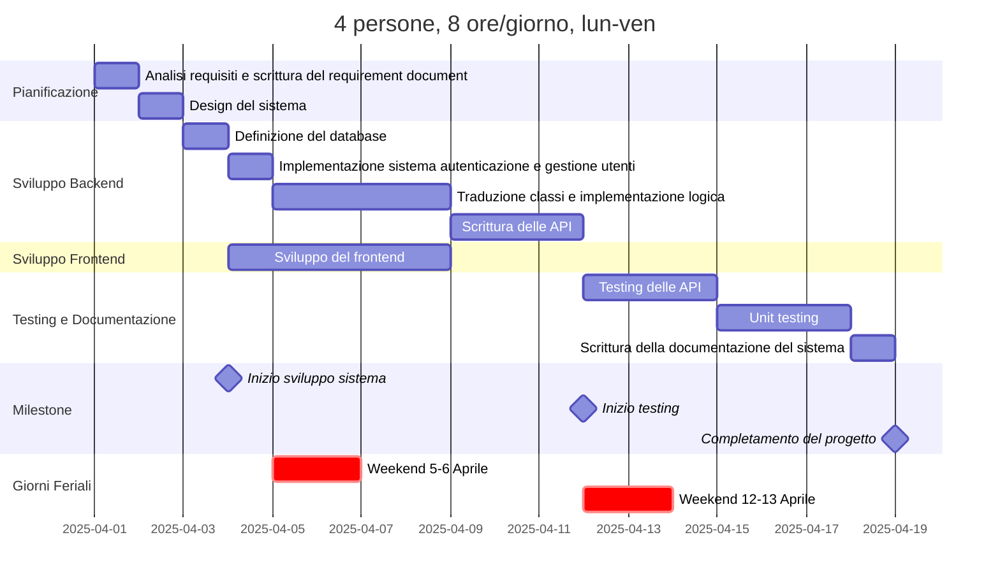

# Project Estimation

Date: 2025-04-13

Version: 

# Estimation approach

Consider the GeoControl project as described in the swagger, assume that you are going to develop the project INDEPENDENT of the deadlines of the course, and from scratch

Nota: "from scratch" inteso come sviluppare tutto da 0, anche il fronted (che nel progetto ci viene fornito già scritto)

# Estimate by size

|                                         | Estimate |
| :-------------------------------------- | :------- |
| NC = Estimated number of classes to be developed | 8 |
| A = Estimated average size per class, in LOC | 200 |
| S = Estimated size of project, in LOC (= NC \* A) | 1600 |
| E = Estimated effort, in person hours (here use productivity 10 LOC per person hour) | 160 |
| C = Estimated cost, in euro (here use 1 person hour cost = 30 euro) | 4800 |
| Estimated calendar time, in calendar weeks (Assume team of 4 people, 8 hours per day, 5 days per week) | 160/(4x8x5) = 1 week |

Classes: user, network, gateway, sensor, stats, measurement, errorHandler, dateTime

# Estimate by product decomposition

###

| component name       | Estimated effort (person hours) |
| -------------------- | ------------------------------- |
| requirement document |            20                   |
| design document      |            20                   |
| code                 |            150                  |
| unit tests           |            50                   |
| api tests            |            20                   |
| management documents |            10                   |

Nota: API molto simili tra loro, principalmente basate su retrieve. Dovrebbero richiedere poco tempo rispetto agli unit tests.

# Estimate by activity decomposition

###

| Activity name | Estimated effort (person hours) |
| ------------- | ------------------------------- |
| Analisi requisiti e scrittura del requirement document | 20 |
| Design del sistema | 20 |
| Definizione del database | 7 |
| Implementazione del sistema di autenticazione e gestione utenti | 10 |
| Traduzione in classi e implementazione della logica di network, gateways e sensori | 40 |
| Scrittura delle API | 50 |
| Sviluppo del frontend | 50 |
| Testing delle api | 20 |
| Unit testing | 50 |
| Scrittura della documentazione del sistema | 10 |

###

Insert here Gantt chart with above activities.

Di seguito si è utilizzata l'estensione di VSCode `Markdown Preview Mermaid Support` per disegnare il diagramma di Gantt.

Nota: sabato e domenica non si lavora. Nel diagramma si sovrappongono della attività in alcuni finesettimana ma questo avviene solo visivamente per non spezzare in due parti alcuni task (es. lo sviluppo del frontend richiede 3 giorni, anche se il chart ne mostra 5 ma solo perchè si sovrappone ad un weekend).

# Summary

Report here the results of the three estimation approaches. The estimates may differ. Discuss here the possible reasons for the difference

|                                    | Estimated effort | Estimated duration |
| ---------------------------------- | ---------------- | ------------------ |
| estimate by size                   |       160        |       1 week       |
| estimate by product decomposition  |       320        |       2 week       |
| estimate by activity decomposition |       277        |       3 week       |

- Il primo approccio si basa solamente sul codice di produzione e non tiene conto dei documenti e attività di pianificazione, test o integrazione tra componenti;

- Il secondo approccio, anche se separa in più attività, non permette ancora di andare a fondo e sviscerare i passaggi in molteplici task;

- L'utimo approccio invece permette di definire le attività proprie del progetto con un vista più dettagliata. 

Come mai, nonstante la penultima attività richieda 320ph, essa necessiti di meno tempo rispetto l'ultima che con 277ph richiede 3 settimane? Si veda il Gantt chart che mostra come per via di alcune dipendenze (e anche per il modo intrinseco con cui si rappresentano le attività sul chart) alcune attività non possono essere parallelizzate. Se ad esempio in un giorno, finita l'attività A, rimanesse un'ora per la successiva attività B, con il penultimo approccio si può direttamente far succedere B ad A nella stessa giornata, mentre sul gantt chart si sposta al giorno dopo. Sarebbe fuorviante indicare sul gantt chart, per una sola ora, un giorno intero di lavoro per l'attività B (che potrebbe anche dipendere da A e quindi essere visualizzate erroneamente come parallelizzabili).