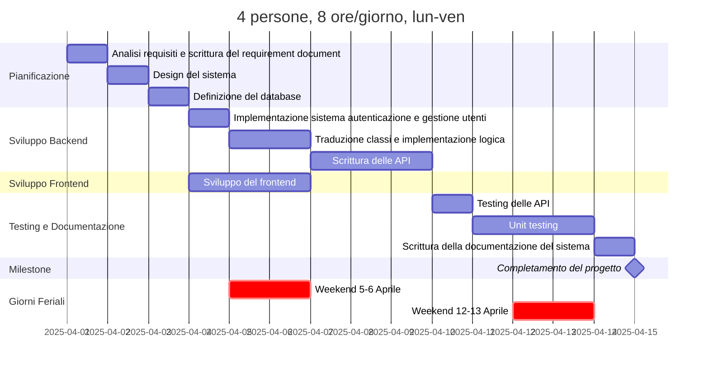

# Project Estimation

Date: 2025-04-13

Version: 

# Estimation approach

Consider the GeoControl project as described in the swagger, assume that you are going to develop the project INDEPENDENT of the deadlines of the course, and from scratch

Nota: "from scratch" inteso come sviluppare tutto da 0, anche il fronted (che nel progetto ci viene fornito già scritto)

# Estimate by size

|                                         | Estimate |
| :-------------------------------------- | :------- |
| NC = Estimated number of classes to be developed | 8 |
| A = Estimated average size per class, in LOC | 200 |
| S = Estimated size of project, in LOC (= NC \* A) | 1600 |
| E = Estimated effort, in person hours (here use productivity 10 LOC per person hour) | 160 |
| C = Estimated cost, in euro (here use 1 person hour cost = 30 euro) | 4800 |
| Estimated calendar time, in calendar weeks (Assume team of 4 people, 8 hours per day, 5 days per week) | 160/(4x8x5) = 1 week |

Classes: user, network, gateway, sensor, stats, measurement, errorHandler, dateTime

# Estimate by product decomposition

###

| component name       | Estimated effort (person hours) |
| -------------------- | ------------------------------- |
| requirement document |            20                   |
| design document      |            20                   |
| code                 |            150                  |
| unit tests           |            50                   |
| api tests            |            20                   |
| management documents |            10                   |

Nota: API molto simili tra loro, principalmente basate su retrieve. Dovrebbero richiedere poco tempo rispetto agli unit tests.

# Estimate by activity decomposition

###

| Activity name | Estimated effort (person hours) |
| ------------- | ------------------------------- |
| Analisi requisiti e scrittura del requirement document | 20 |
| Design del sistema | 20 |
| Definizione del database | 7 |
| Implementazione del sistema di autenticazione e gestione utenti | 10 |
| Traduzione in classi e implementazione della logica di network, gateways e sensori | 40 |
| Scrittura delle API | 50 |
| Sviluppo del frontend | 50 |
| Testing delle api | 20 |
| Unit testing | 50 |
| Scrittura della documentazione del sistema | 10 |

###

Insert here Gantt chart with above activities.

# Summary

Report here the results of the three estimation approaches. The estimates may differ. Discuss here the possible reasons for the difference

|                                    | Estimated effort | Estimated duration |
| ---------------------------------- | ---------------- | ------------------ |
| estimate by size                   |                  |                    |
| estimate by product decomposition  |                  |                    |
| estimate by activity decomposition |                  |                    |
