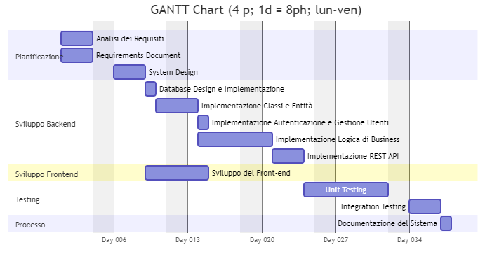

# Project Estimation

Date: 2025-04-18

Version: 1.0

## Estimation approach

<Consider the GeoControl project as described in the swagger, assume that you are going to develop the project INDEPENDENT of the deadlines of the course, and from scratch>

## Estimate by Size

__LEGENDA__:
- NC = __Estimated Number of Classes__ to be developed
- A = __Estimated Average Size per Class__, in LOC
- S = __Estimated Size of Project__, in LOC => $NC * A$
- E = __Estimated Effort__, in person hours => $S / (10 \frac{LOC}{h})$
- C = __Estimated Cost__, in euro => $E * 30€$
- __Estimated Calendar Time__, in calendar weeks => $E / (4 * 8 \frac{h}{day} * 5 \frac{days}{week})$

| Metric                  | Estimate            |
| :---------------------- | :------------------ |
| NC                      | 60                  |
| A                       | 50                  |
| S                       | 3000                |
| E                       | 300                 |
| C                       | 9000 			    |
| Estimated Calendar Time | 1.875w (1w, 4d, 3h) |

__NOTE__: 
- Si assume che con "class" si intenda il concetto "class" di Java, ovvero un "modulo". Se così non fosse, la stima NC sarebbe poco informativa in quanto non includerebbe tutti i moduli del sistema che non sono classi.
- Considerando che per questa stima si assume di partire _from scratch_: si assume un numero di "concetti base" tra 5-6, e si considera che tali concetti saranno moltiplicati per i vari macro-package (repository, model, controller, view, routes, dao, dto, ecc.). A questi vanno poi sommati i vari moduli di supporto, utils, errori, e configurazione.
- La stima di 50 LOC per classe è apparente bassa, ma questo è dovuto al fatto che la maggioranza dei moduli sono piccoli (es: DTO, DAO, ecc.) e non contengono codice di gestione algoritmica.
- La stima imposta di 10 LOC/h è abbastanza pessimistica per questo tipo di situazione (ovvero scrittura di un intero progetto _from scratch_). Per questo la stima finale è probabilmente inflazionata.
- Le unità di misura sono sempre basate su Person Hours, quindi con `d` si intende `pd` (Person Days), ovvero 8h. Stesso concetto per week.


## Estimate by Product Decomposition

| Component Name       | Estimated Effort (person hours) |
| -------------------- | ------------------------------- |
| Requirement Document |            40                   |
| Design Document      |            20                   |
| Code                 |            120                  |
| Unit Tests           |            50                   |
| API Tests            |            20                   |
| Management Documents |            10                   |

__NOTE__:
- La stima del "Code" differisce dalla Estimate by Size in quanto si è deciso, nelle altre Estimate, di non considerare il vincolo di 10 LOC/h.
- Si indica con "person hours" il tempo di lavoro totale, ovvero l'Estimated Effort totale (senza considerare il numero di persone nel team).
- Si assume un Design Document semplice, trattandosi di un sistema simil-microservizi e che ha quindi architetture e pattern standardizzate (ed è in più anche di piccole dimensioni).
- Si assume che "API Test" significhi "Integration Testing". Questa fase è relativamente rapida in quanto ci si basa su REST API le quali sono relativamente semplici da testare.
- Si assume che "Management Documents" si riferisca a documenti di gestione del progetto (Timesheet, Estimation, tempo passato su tool di ALM e Configuration Management)


## Estimate by Activity Decomposition

| Activity Name | Estimated Effort (person hours) |
| :------------ | :------------------------------ |
| Analisi Requisiti | 20 |
| Requirements Document | 20 |
| System Design | 20 |
| Database Design & Implementazione | 4 |
| Implementazione Classi e Entità | 12 |
| Implementazione Autenticazione e Gestione Utenti | 8 |
| Implementazione Logica di Business | 40 |
| Implementazione REST API | 24 |
| Sviluppo del Front-end | 32 |
| Unit Testing | 50 |
| Integration Testing | 20 |
| Documentazione del Sistema | 10 |

__NOTE__:
- La stima del "Code" differisce dalla Estimate by Size in quanto si è deciso, nelle altre Estimate, di non considerare il vincolo di 10 LOC/h.
- Si assume di dover seguire una pipeline di Testing standard modello Waterfall, ovvero si inizia a testare solo al termine dello sviluppo, inoltre Unit e Integration Testing sono consequenziali e non paralleli.
- La Documentazione del Sistema non era presente nelle altre Estimate, ma si crede sia una attività che fa parte del progettare _from scratch_.

### GANTT Chart

<!-- La versione di Mermaid su git-softeng.polito.it è troppo arretrata e qui viene lanciato un errore di sintassi, per cui si carica uno screenshot -->
<!-- ```mermaid

gantt
    title GANTT Chart (4 p; 1d = 8ph; lun-ven)
    dateFormat  YYYY-MM-DD
    todayMarker off
    tickinterval 1week
	excludes weekends
	weekday monday
	axisFormat Day %j


    section Pianificazione
    	Analisi dei Requisiti								:a1, 2025-01-01, 2.5d
   		Requirements Document								:a2, 2025-01-01, 2.5d
		System Design										:a3, after a1, 2.5d

    section Sviluppo Backend
		Database Design e Implementazione					:b1, after a3, 0.5d
		Implementazione Classi e Entità						:b2, after b1, 1.5d
		Implementazione Autenticazione e Gestione Utenti	:b5, after b2, 1d
		Implementazione Logica di Business                  :b3, after b2, 5d
		Implementazione REST API							:b4, after b3, 3d

	section Sviluppo Frontend
		Sviluppo del Front-end								:c1, after a3, 4d

	section Testing
		Unit Testing									    :d1, after b4, 6.25d
		Integration Testing								    :d2, after d1, 2.5d
    
    section Processo
		Documentazione del Sistema							:e1, after d2, 1.25d

``` -->




## Summary

| Estimate Type                      | Estimated Effort | Estimated Duration |
| ---------------------------------- | ---------------- | ------------------ |
| Estimate by Size                   |       300        |      1.875 week    |
| Estimate by Product Decomposition  |       260        |      1.625 week    |
| Estimate by Activity Decomposition |       260        |      1.450 week    |

La differenza della Estimed Effort tra la Estimate by Size e le Estimate by Decomposition è dovuta a due motivi:
- Nella prima ci si basa sulla stima imposta di 10 LOC/h, mentre nelle seconde si è utilizza una stima differenze meno pessimistica.
- Le stime misurano cose diverse, ad esempio Estimate by Size stima solo il Code, mentre le altre stime includono quasi tutto il processo di sviluppo del Software.

La differenza della Estimated Duration tra la Estimate by Product Decomposition e la Estimate by Activity Decomposition è dovuta alla scomposizione delle attività utilizzando il GANTT Chart.
- Utilizzando il GANTT Chart sono state evidenziate delle attività che possono essere _potenzialmente_ svolte in parallelo, accorciando così la stima best-case.