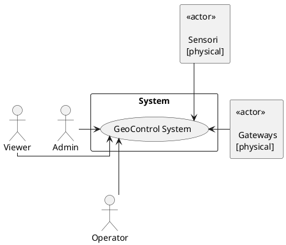
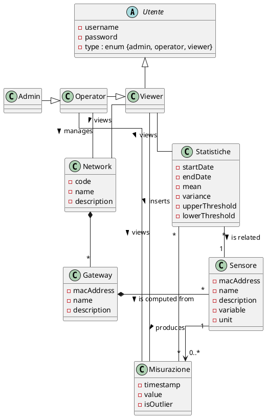
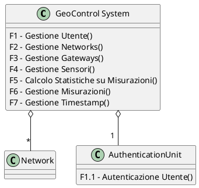
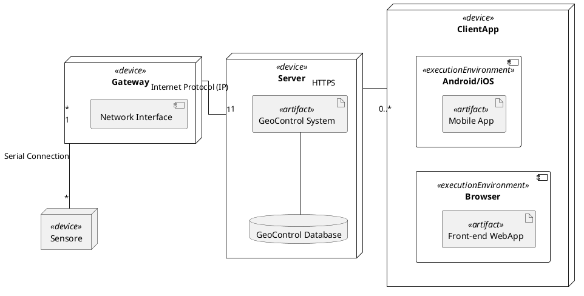

# Requirements Document - GeoControl

Date:

Version: V1 - description of Geocontrol as described in the swagger

| Version number | Change |
| :------------: | :----: |
|                |        |

# Contents

- [Requirements Document - GeoControl](#requirements-document---geocontrol)
- [Contents](#contents)
- [Informal description](#informal-description)
- [Business model](#business-model)
- [Stakeholders](#stakeholders)
- [Context Diagram and interfaces](#context-diagram-and-interfaces)
  - [Context Diagram](#context-diagram)
  - [Interfaces](#interfaces)
- [Stories and personas](#stories-and-personas)
- [Functional and non functional requirements](#functional-and-non-functional-requirements)
  - [Functional Requirements](#functional-requirements)
  - [Non Functional Requirements](#non-functional-requirements)
- [Use case diagram and use cases](#use-case-diagram-and-use-cases)
  - [Use case diagram](#use-case-diagram)
    - [Use case 1, UC1](#use-case-1-uc1)
      - [Scenario 1.1](#scenario-11)
      - [Scenario 1.2](#scenario-12)
      - [Scenario 1.x](#scenario-1x)
    - [Use case 2, UC2](#use-case-2-uc2)
    - [Use case x, UCx](#use-case-x-ucx)
- [Glossary](#glossary)
- [System Design](#system-design)
- [Deployment Diagram](#deployment-diagram)

# Informal description

GeoControl è un software progettato per monitorare le variabili fisiche e ambientali in vari contesti: da analisi idrologiche di aree montane al sorvegliamento di edifici storici, e anche il controllo di parametri interni (quali temperatura o illuminazione) in aree residenziali o di lavoro.

# Business Model

__Sistema Software su Licenza__:
la compagnia che sviluppa GeoControl vende il software offrendo licenza annuale o come one-time-purchase. Vi sono diversi Tier di licenza tra cui quelli più avanzati che includono supporto tecnico e manutenzione della parte hardware del sistema (sensori e gateway).

# Stakeholders

| Stakeholder name | Description |
| :--------------- | :---------- |
|       Admin      |  Utente che ha accesso a tutte le risorse, inclusa la gestione di Networks e Utenti |
|      Operator    |  Utente che può gestire Network, Gateway, Sensori e inserire misurazioni |
|       Viewer     |  Utente che può solo consultare i dati |
| Unione delle Comunità Montane del Piemonte | Committente principale del Sistema |
| Enti Pubblici e Privati | Università, cittadine, Protezione Civile o aziende che vogliono usufruire dei servizi del Sistema |
| Produttori di Componenti | Coloro che si occupano di produzione e distribuzione dell'Hardware utilizzato nel Sistema |

# Context Diagram and Interfaces

## Context Diagram

__NOTE su DIAGRAMMA__: 
- In più punti dello Swagger viene suggerito come Gateways e Sensori siano entrambi entità esterne a GeoControl System. Non è specificato da nessuna parte se queste componenti siano poi effettivamente vendute dalla stessa azienda insieme al sistema. Si assume che GeoControl possa funzionare con qualsiasi Gateway e Sensore compatibile (anche di terze parti) per cui si possono considerare entità esterne al sistema.

### Context Diagram - Draw.io

[Context Diagram - Draw.io](./res/Context_Diagram.png)

### Context Diagram - PlantUML

## Interfaces

\<describe here each interface in the context diagram>

|   Actor   | Logical Interface | Physical Interface |
| :-------- | :---------------: | :----------------: |
| Admin     | GUI               | PC                 |
| Operator  | GUI               | PC                 |
| Viewer    | GUI               | PC, Smartphone     |

# Stories and personas

\<A Persona is a realistic impersonation of an actor. Define here a few personas and describe in plain text how a persona interacts with the system>

\<Persona is-an-instance-of actor>

\<stories will be formalized later as scenarios in use cases>

- Persona1 : Uomo, Adulto, 50 anni, Lavora come informatico nel comune di una cittadina ad alto rischio sismico
  Storia : Ha bisogno di un Sistema per monitorare l'attività sismica della città

- Persona2 : Donna, Giovane, 25 anni, lavora in una riserva naturale come guida
  Storia : Ha bisogno di sapere in anticipo le condizioni climatiche per evitare di mettere in pericolo i visitatori durante le passeggiate

- Persona3 : Uomo, Età media, 34 anni, gestore hotel in alta quota aperto in periodo invernale
  Storia : Ha bisogno di un sistema per monitorare il rischio di valanghe o temperature estreme al fine di migliorare l'esperienza di chi alloggia nell'hotel

- Persona4: Gruppo di ricerca universitario
  Storia: Hanno bisogno di dati ambientali per testare modelli di machine learning per predizioni metereologiche per una ricerca

- Persona5: Donna, Adulta, 46 anni, preside di una scuola media
  Storia: Nell'attesa di un cambio struttura, la preside ha bisogno di monitorare alcuni parametri particolari di quella attuale, vecchia e decadente, ad esempio crepe e fessurazioni o vibrazioni anomale.

# Functional and non functional requirements

## Functional Requirements

\<In the form DO SOMETHING, or VERB NOUN, describe high level capabilities of the system>

\<they match to high level use cases>

|  ID   | Description |
| :---- | :---------- |
| __FR1__   | __Gestione Utente__ |
| FR1.1 | Autenticazione Utente |
| FR1.2 | Creazione Account|
| FR1.3 | Ottenimento Elenco Utenti |
| FR1.4 | Ottenimento Utente Specifico |
| FR1.5 | Eliminazione Account |
| __FR2__   | __Gestione Networks__ |
| FR2.1 | Creazione Network |
| FR2.2 | Ottenimento Elenco Networks |
| FR2.3 | Ottenimento Network Specifico |
| FR2.4 | Modifica Dati Network |
| FR2.5 | Eliminazione Network |
| __FR3__   | __Gestione Gateways__ |
| FR3.1 | Creazione Gateway |
| FR3.2 | Ottenimento Elenco Gateway per Network Specifico |
| FR3.3 | Ottenimento Gateway Specifico | 
| FR3.4 | Modifica Dati Gateway |
| FR3.5 | Eliminazione Gateway |
| __FR4__   | __Gestione Sensori__ |
| FR4.1 | Creazione Sensore |
| FR4.2 | Ottenimento Elenco Sensori per Gateway Specifico |
| FR4.3 | Ottenimento Sensore Specifico |
| FR4.4 | Modifica Dati Sensore |
| FR4.5 | Eliminazione Sensore|
| __FR5__   | __Calcolo Statistiche su Misurazioni__ |
| FR5.1 | Calcolo Media su Misurazioni in Range Temporale |
| FR5.2 | Calcolo Varianza su Misurazioni in Range Temporale |
| __FR6__   | __Gestione Misurazioni__ |
| FR6.1 | Creazione Misurazione |
| FR6.2 | Ottenimento Elenco Misurazioni di Network Specifico |
| FR6.3 | Ottenimento Elenco Misurazioni di Sensore Specifico |
| FR6.4 | Ottenimento Elenco Statistiche di Network Specifico |
| FR6.5 | Ottenimento Elenco Statistiche di Sensore Specifico |
| FR6.6 | Ottenimento Elenco Outliers di Network Specifico |
| FR6.7 | Ottenimento Elenco Outliers di Sensore Specifico |
| __FR7__   | __Gestione Timestamp__ |
| FR7.1 | Conversione Timestamp a Tempo Locale |

## Non Functional Requirements

\<Describe constraints on functional requirements>

|   ID    | Type (efficiency, reliability, ..) | Description | Refers to |
| :-----: | :--------------------------------: | :---------: | :-------: |
|  NFR1   |  Domain                            | Il sistema deve convertire, memorizzare e restituire i timestamp nel formato ISO 8601 (UTC) | FR 6 |
|  NFR2   |  Reliability                       | Non devono essere perse più di 6 misurazioni per sensore ogni anno | FR 6 |
|  NFR3   |  Reliability                       | Il timestamp deve corrispondere all'esatto momento della misurazione | FR 6 |
|  NFR4   |  Reliability                       | Il flusso di misurazioni non deve essere interrotto | FR 6 |
|  NFR5   |  Domain                            | La misurazioni deve avvenire ogni 10 minuti | FR 6 |

# Use case diagram and use cases

## Use case diagram

\<define here UML Use case diagram UCD summarizing all use cases, and their relationships>

\<next describe here each use case in the UCD>

### Use case 1, UC1

| Actors Involved  |                                                                      |
| :--------------: | :------------------------------------------------------------------- |
|   Precondition   | \<Boolean expression, must evaluate to true before the UC can start> |
|  Post condition  |  \<Boolean expression, must evaluate to true after UC is finished>   |
| Nominal Scenario |         \<Textual description of actions executed by the UC>         |
|     Variants     |                      \<other normal executions>                      |
|    Exceptions    |                        \<exceptions, errors >                        |

##### Scenario 1.1

\<describe here scenarios instances of UC1>

\<a scenario is a sequence of steps that corresponds to a particular execution of one use case>

\<a scenario is a more formal description of a story>

\<only relevant scenarios should be described>

|  Scenario 1.1  |                                                                            |
| :------------- | :------------------------------------------------------------------------- |
|  Precondition  | \<Boolean expression, must evaluate to true before the scenario can start> |
| Post condition |  \<Boolean expression, must evaluate to true after scenario is finished>   |
|     Step#      |                                Description                                 |
|       1        |                                                                            |
|       2        |                                                                            |
|      ...       |                                                                            |

##### Scenario 1.2

##### Scenario 1.x

### Use case 2, UC2

..

### Use case x, UCx

..

# Glossary

\<use UML class diagram to define important terms, or concepts in the domain of the application, and their relationships>

\<concepts must be used consistently all over the document, ex in use cases, requirements etc>

## Glossary Terms

- __Utente__: è un attore del sistema, può essere un Admin, un Operator o un Viewer.  È identificato da uno `username` (a volte detto `userName`) e dettagliato con `password` e `type`.
	- `username`: identificativo unicovo di un `Utente`. [Lunghezza Minima: 1]
	- `password`: utilizzata in combinazione con lo `username` per autenticare un `Utente` nel sistema (ricevendo un `Token`). [Lunghezza Minima: 5]
	- `type`: è il tipo di `Utente`, definisce il ruolo dell'Utente e il livello di accesso alle funzionalità. Può essere:
		- `admin`: identifica un `Utente` di tipo `Admin`.
		- `operator`: identifica un `Utente` di tipo `Operator`.
		- `viewer`: identifica un `Utente` di tipo `Viewer`.

	- __Account__: è un Alias di `Utente`. È in pratica la rappresentazione in forma di dato di un Utente del sistema. Si definisce questo Alias per non confondersi tra il concetto di Utente come dato o classe del sistema (Utente, User) e il concetto di Utente come Attore, ovvero una persona fisica del mondo reale che interagisce con il sistema.

- __Admin__: è un Utente con accesso completo alle risorse e alle funzionalità. Può gestire completamente i tutti Network (e quindi tutti i Gateway e Sensori) e tutti gli Utenti (Account). 

- __Operator__: è un Utente con accesso a tutte le funzionalità di gestione dei Network (e quindi di tutti i Gateway e Sensori) ma senza accesso alla gestione degli Utenti (Account).

- __Viewer__: è un utente con accesso limitato al sistema. Può solo visualizzare i dati del sistema (tutti) ma non può modificarli. Non ha accesso alla visualizzazione e gestione degli Utenti (Account).

- __Network__: raggruppamento Logico di `Gateway` (e corrispettivi `Sensori` associati). Non corrisponde a un device fisico ma è una entità software per organizzare e gestire gruppi di device. (Esempio: un singolo Network monitora un singolo comune o singolo edificio).  È identificato da un `code` (a volte detto `networkCode`) e dettagliato con `name` e `description`.
	- `code`: identificativo univoco di un `Network`. [Alfanumerico, Lunghezza Minima: 1]
	- `name`: nome del `Network`. [Nessun Formato Specificato]
	- `description`: descrizione del `Network`. [Nessun Formato Specificato]

- __Gateway__: device fisico dotato di una interfaccia di rete e connesso al GeoControl System tramite essa; è collegato a uno o più `Sensori` tramite una interfaccia seriale dalla quale riceve le informazioni delle `Misurazioni`. È in grado di eseguire la conversione digitale dei dati ottenuti dai `Sensori` e trasmetterli sulla rete.  È identificato da un `macAddess` (a volte detto `gatewayMac`) e dettagliato con `name` e `description`.
	- `macAddress`: identificativo univoco di un `Gateway`. [Indirizzo MAC (standard Ethernet)]
	- `name`: nome del `Gateway`. [Nessun Formato Specificato]
	- `description`: descrizione del `Gateway`. [Nessun Formato Specificato] 

- __Sensore__: device fisico che esegue le effettive misurazioni delle "quantità fisiche" (le misurazioni vengono eseguite ogni 10 minuti). Non dispone di una interfaccia di rete. È associato a un solo `Gateway` al quale è collegato mediante una connessione seriale. Oltre ai dati della misurazione, il `Sensore` invia anche il timestamp della misurazione nel Formato ISO 8601 nella timezone locale.  È identificato da un `macAddress` (a volte detto `sensorMac`) e dettagliato con `name`, `description`, `variable` (a volte detto `value`) e `unit`.
	- `macAddress`: identificativo univoco di un `Sensore`. [Indirizzo MAC (standard Ethernet)]
	- `name`: nome del `Sensore`. [Nessun Formato Specificato]
	- `description`: descrizione del `Sensore`. [Nessun Formato Specificato]
	- `variable`: misura del "dato fisico" misurato dal `Sensore`. [Nessun Formato Specificato]
	- `unit`: unità di misura del valore `variable`. [Nessun Formato Specificato] 

- __Misurazione__: è eseguita da un `Sensore`, collezionate dal `Gateway` corrispondente, inviata sul `Network` corrispondente e memorizzata dal GeoControl System.  Include `timestamp` (a volte detto `createdAt`), `value`, `isOutlier`.
	- `timestamp`: momento in cui è stata eseguita la misurazione. È convertito dal sistema nella timezone UTC. [Formato ISO 8601]
	- `value`: valore associato alla misurazione (ovvero valore della misura `variable` del `Sensore`). [Numero Reale]
	- `isOutlier`: indica se il valore di `value` è fuori dalle threshold `upperThreshold` e `lowerThreshold`. A differenza degli altri attributi, non è un dato persistente. [Booleano]

- __Statistiche di Misurazioni__: (o semplicemente __Statistiche__) è un insieme di valori calcolati rispetto a un insieme di `Misurazioni` identificate da un range temporale.  Include `startDate`, `endDate`, `mean`, `variance`, `upperThreshold` e `lowerThreshold`.
	- `startDate`: timestamp di inizio del range temporale. [Formato ISO 8601]
	- `endDate`: timestamp di fine del range temporale. [Formato ISO 8601]
	- `mean`: Media delle misurazioni eseguite nel range temporale. Indicato con $\mu$. [Numero Reale]
	- `variance`: Varianza delle misurazioni eseguite nel range temporale. Indicato con $\sigma$. [Numero Reale]
	- `upperThreshold`: threshold superiore utilizzato per l'Outlier Detection. Calcolato tramite Media e varianza. [Numero Reale]
		- `upperThreshold` $= \mu+2\sigma$.
	- `lowerThreshold`: threshold inferiore utilizzato per l'Outlier Detection. Calcolato tramite Media e varianza. [Numero Reale]
		- `lowerThreshold` $= \mu-2\sigma$.

- __Misurazione Outlier__: (o semplicemente __Outlier__) è una `Misurazione` il cui valore `value` è più alto della `upperThreshold` o più basso della `lowerThreshold`. L'insieme delle `Misurazioni` Outlier è un sottoinsieme delle `Misurazioni`.

- __Formato ISO 8601__: è uno standard internazionale per la rappresentazione di date e orari. Ha lo scopo di evitare ambiguità e confusione tra le varie rappresentazioni di date e orari.
	- __Timezone UTC__: è la Timezone del Coordinated Universal Time (UTC), ovvero il fuso orario standard universale di riferimento. UTC non cambia con l'ora legale, quindi rimane costante durante tutto l'anno.

## Glossary Diagram

__NOTE su DIAGRAMMA__: 
Si assume che questo Diagramma del Glossario non debba essere un vero e proprio UML Class Diagram. In pratica questo diagramma rappresenta concetti e relazioni piuttosto che classi. Si specifica questo in quanto sono state fatte delle scelte appartentemente ambigue.
- Ovviamente non avrebbe senso rappresentare sia le classi dei Ruoli (Admin, Operator, Viewer) che avere l'attributo di tipo enum `type` in Utente (anzi non avrebbe proprio senso rappresentare Utente in primo luogo, in quanto Viewer è sufficiente). Lo si è fatto in modo da poter rappresentare esplicitamente le relazioni tra i singoli ruoli e le singole funzionalità.
- Si è scelto di non rappresentare il concetto di "oggetto Misurazione e Statistiche" (ovvero quello che negli Schemas dello Swagger è definito come `Measurements`), in quanto non è qualcosa di tangile dal punto di vista concettuale ma è semplicemente un modo per raggruppare un singolo output.
- La relazione tra `Operator` e `Misurazione` potrebbe essere omessa in quanto vi è un collegamento implicito tramite `Network`. In ogni caso su questo vi è ambiguità in quanto non è chiaro se le misurazioni siano inserite ogni 10 minuti al momento che il Sensore le produce o se un Operator debba inserirle manualmente. 

### Glossary Diagram - Draw.io

### Glossary Diagram - PlantUML

# System Design

__NOTE su DIAGRAMMA__: 
- Vale anche qui la nota del Context Diagram.
- Si assume che il "token-based authentication mechanism" non sia qualcosa di esterno, ma sia compreso nel sistema. Inoltre, viene considerato come un "modulo" o "componente" a se stante.

## System Diagram - Draw.io

## System Diagram - PlantUML

# Deployment Diagram

__NOTE su DIAGRAMMA__: 
- Il diagramma PlantUML viene generato in modo atroce, non lo si consideri più di tanto.
- Le due componenti "\<\<executionEnvironment>>" del Nodo ClientApp sono da intendersi in alternativa. 

## Deployment Diagram - Draw.io

## Deployment Diagram - PlantUML

