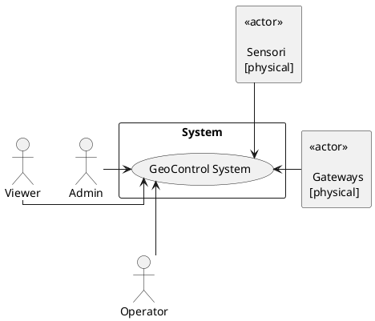
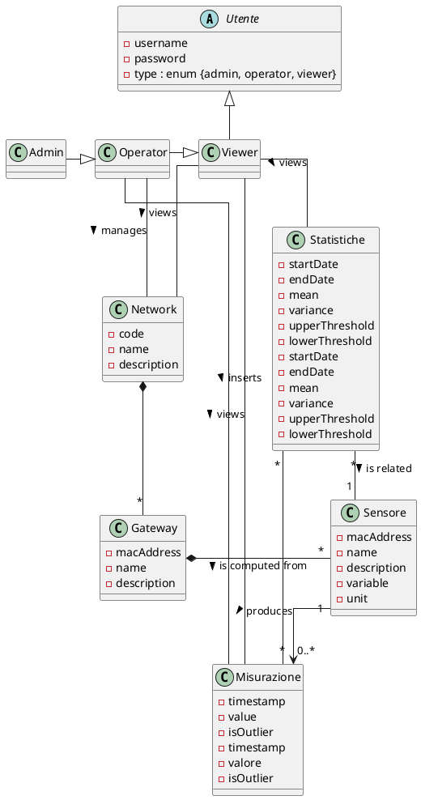
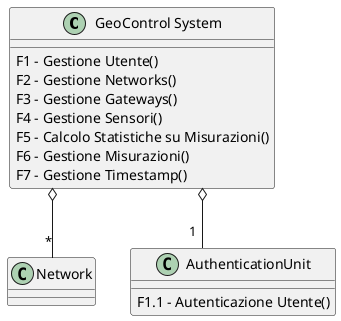
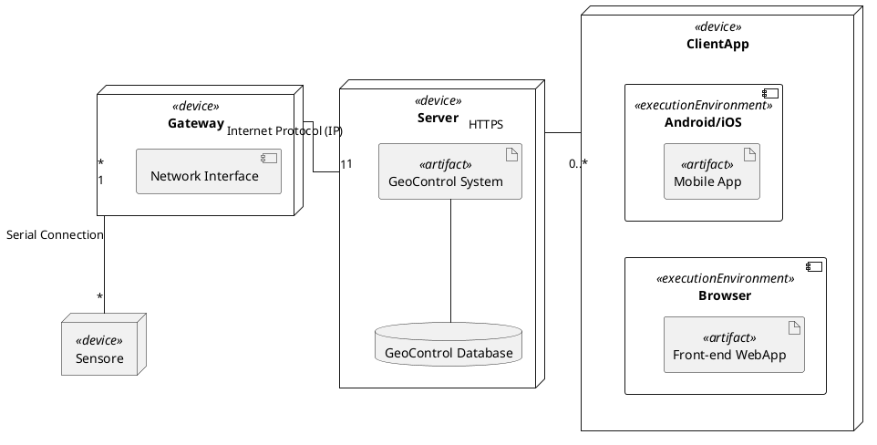

# Requirements Document - GeoControl

Date:

Version: V1 - description of Geocontrol as described in the swagger

| Version number | Change |
| :------------: | :----: |
|                |        |

## Contents
## Contents

- [Requirements Document - GeoControl](#requirements-document---geocontrol)
  * [Contents](#contents)
  * [Informal Description](#informal-description)
  * [Business Model](#business-model)
  * [Stakeholders](#stakeholders)
  * [Context Diagram and Interfaces](#context-diagram-and-interfaces)
    + [Context Diagram](#context-diagram)
    + [Interfaces](#interfaces)
  * [Stories and Personas](#stories-and-personas)
  * [Functional and Non-Functional Requirements](#functional-and-non-functional-requirements)
    + [Functional Requirements](#functional-requirements)
      - [Access Rights](#access-rights)
    + [Non-Functional Requirements](#non-functional-requirements)
  * [Use Case Diagram and Use Cases](#use-case-diagram-and-use-cases)
    + [Use Case Diagram](#use-case-diagram)
    + [Use Cases](#use-cases)
      - [Use Case 0 (UC0): Template for Use Cases](#use-case-0--uc0---template-for-use-cases)
        * [Scenario 0.1](#scenario-01)
      - [Use case 1 (UC1): Autenticazione al Sistema](#use-case-1--uc1---autenticazione-al-sistema)
        * [Scenario 1.1](#scenario-11)
        * [Scenario 1.2](#scenario-12)
        * [Scenario 1.3](#scenario-13)
        * [Scenario 1.4](#scenario-14)
        * [Scenario 1.5](#scenario-15)
      - [Use Case 2 (UC2): Creazione Account](#use-case-2--uc2---creazione-account)
        * [Scenario 2.1](#scenario-21)
        * [Scenario 2.2](#scenario-22)
        * [Scenario 2.3](#scenario-23)
        * [Scenario 2.4](#scenario-24)
        * [Scenario 2.5](#scenario-25)
        * [Scenario 2.6](#scenario-26)
      - [Use Case 3 (UC3): Ottenimento Utente](#use-case-3--uc3---ottenimento-utente)
        * [Scenario 3.1](#scenario-31)
        * [Scenario 3.2](#scenario-32)
        * [Scenario 3.3](#scenario-33)
        * [Scenario 3.4](#scenario-34)
        * [Scenario 3.5](#scenario-35)
        * [Scenario 3.6](#scenario-36)
      - [Use Case 4 (UC4): Eliminazione Account](#use-case-4--uc4---eliminazione-account)
        * [Scenario 4.1](#scenario-41)
        * [Scenario 4.2](#scenario-42)
        * [Scenario 4.3](#scenario-43)
        * [Scenario 4.4](#scenario-44)
        * [Scenario 4.5](#scenario-45)
      - [Use case 5, Gestione Networks](#use-case-5--gestione-networks)
        * [Scenario 5.1: Recupero di tutte le Reti](#scenario-51--recupero-di-tutte-le-reti)
        * [Scenario 5.2: Recupero di una Rete specifica](#scenario-52--recupero-di-una-rete-specifica)
        * [Scenario 5.3: Creazione di una Nuova Rete](#scenario-53--creazione-di-una-nuova-rete)
        * [Scenario 5.4: Aggiornamento della Rete](#scenario-54--aggiornamento-della-rete)
        * [Scenario 5.5: Cancellazione della Rete](#scenario-55--cancellazione-della-rete)
        * [Scenario 5.6: Errore di Autorizzazione (401 Unauthorized)](#scenario-56--errore-di-autorizzazione--401-unauthorized-)
        * [Scenario 5.7: Errore di Permessi Insufficienti (403 Forbidden)](#scenario-57--errore-di-permessi-insufficienti--403-forbidden-)
        * [Scenario 5.8: Errore Interno del Server (500 Internal Server Error)](#scenario-58--errore-interno-del-server--500-internal-server-error-)
        * [Scenario 5.9: Rete Non Trovata (404 Not Found)](#scenario-59--rete-non-trovata--404-not-found-)
        * [Scenario 5.10: Conflitto (409 Conflict)](#scenario-410--conflitto--409-conflict-)
  * [Glossary](#glossary)
    + [Glossary Diagram](#glossary-diagram)
  * [System Design](#system-design)
  * [Deployment Diagram](#deployment-diagram)
  * [Contents](#contents)
  * [Informal Description](#informal-description)
  * [Business Model](#business-model)
  * [Stakeholders](#stakeholders)
  * [Context Diagram and Interfaces](#context-diagram-and-interfaces)
    + [Context Diagram](#context-diagram)
    + [Interfaces](#interfaces)
  * [Stories and Personas](#stories-and-personas)
  * [Functional and Non-Functional Requirements](#functional-and-non-functional-requirements)
    + [Functional Requirements](#functional-requirements)
      - [Access Rights](#access-rights)
    + [Non-Functional Requirements](#non-functional-requirements)
  * [Use Case Diagram and Use Cases](#use-case-diagram-and-use-cases)
    + [Use Case Diagram](#use-case-diagram)
    + [Use Cases](#use-cases)
      - [Use Case 0 (UC0): Template for Use Cases](#use-case-0--uc0---template-for-use-cases)
        * [Scenario 0.1](#scenario-01)
      - [Use case 1 (UC1): Autenticazione al Sistema](#use-case-1--uc1---autenticazione-al-sistema)
        * [Scenario 1.1](#scenario-11)
        * [Scenario 1.2](#scenario-12)
        * [Scenario 1.3](#scenario-13)
        * [Scenario 1.4](#scenario-14)
        * [Scenario 1.5](#scenario-15)
      - [Use Case 2 (UC2): Creazione Account](#use-case-2--uc2---creazione-account)
        * [Scenario 2.1](#scenario-21)
        * [Scenario 2.2](#scenario-22)
        * [Scenario 2.3](#scenario-23)
        * [Scenario 2.4](#scenario-24)
        * [Scenario 2.5](#scenario-25)
        * [Scenario 2.6](#scenario-26)
      - [Use Case 3 (UC3): Ottenimento Utente](#use-case-3--uc3---ottenimento-utente)
        * [Scenario 3.1](#scenario-31)
        * [Scenario 3.2](#scenario-32)
        * [Scenario 3.3](#scenario-33)
        * [Scenario 3.4](#scenario-34)
        * [Scenario 3.5](#scenario-35)
        * [Scenario 3.6](#scenario-36)
      - [Use Case 4 (UC4): Eliminazione Account](#use-case-4--uc4---eliminazione-account)
        * [Scenario 4.1](#scenario-41)
        * [Scenario 4.2](#scenario-42)
        * [Scenario 4.3](#scenario-43)
        * [Scenario 4.4](#scenario-44)
        * [Scenario 4.5](#scenario-45)
      - [Use case 5, Gestione Networks](#use-case-5--gestione-networks)
        * [Scenario 5.1: Recupero di tutte le Reti](#scenario-51--recupero-di-tutte-le-reti)
        * [Scenario 5.2: Recupero di una Rete specifica](#scenario-52--recupero-di-una-rete-specifica)
        * [Scenario 5.3: Creazione di una Nuova Rete](#scenario-53--creazione-di-una-nuova-rete)
        * [Scenario 5.4: Aggiornamento della Rete](#scenario-54--aggiornamento-della-rete)
        * [Scenario 5.5: Cancellazione della Rete](#scenario-55--cancellazione-della-rete)
        * [Scenario 5.6: Errore di Autorizzazione (401 Unauthorized)](#scenario-56--errore-di-autorizzazione--401-unauthorized-)
        * [Scenario 5.7: Errore di Permessi Insufficienti (403 Forbidden)](#scenario-57--errore-di-permessi-insufficienti--403-forbidden-)
        * [Scenario 5.8: Errore Interno del Server (500 Internal Server Error)](#scenario-58--errore-interno-del-server--500-internal-server-error-)
        * [Scenario 5.9: Rete Non Trovata (404 Not Found)](#scenario-59--rete-non-trovata--404-not-found-)
        * [Scenario 5.10: Conflitto (409 Conflict)](#scenario-410--conflitto--409-conflict-)
  * [Glossary](#glossary)
    + [Glossary Diagram](#glossary-diagram)
  * [System Design](#system-design)
  * [Deployment Diagram](#deployment-diagram)

<small><i><a href='http://ecotrust-canada.github.io/markdown-toc/'>Table of contents generated with markdown-toc</a> TODO: TOGLIERE STA ROBA POI</i></small>

## Informal Description

GeoControl è un software progettato per monitorare le variabili fisiche e ambientali in vari contesti: da analisi idrologiche di aree montane al sorvegliamento di edifici storici, e anche il controllo di parametri interni (quali temperatura o illuminazione) in aree residenziali o di lavoro.

## Business Model

__Sistema Software su Licenza__:
la compagnia che sviluppa GeoControl vende il software offrendo licenza annuale o come one-time-purchase. Vi sono diversi Tier di licenza tra cui quelli più avanzati che includono supporto tecnico e manutenzione della parte hardware del sistema (sensori e gateway).

## Stakeholders

| Stakeholder name | Description |
| :--------------- | :---------- |
| Admin |  Utente che ha accesso a tutte le risorse e funzionalità del sistema, inclusa la gestione degli Utenti |
| Operator |  Utente che può gestire Network, Gateway, Sensori e inserire Misurazioni |
| Viewer |  Utente che può solo consultare i dati |
| Unione delle Comunità Montane del Piemonte | Committente principale del Sistema |
| Aziende Private | Aziende che vogliono monitorare i propri edifici o aree di lavoro |
| Enti di Ricerca | Università e centri di ricerca che sono interessati ai dati raccolti dal Sistema |
| Enti Governativi | Enti che si occupano di monitoraggio ambientale e gestione del territorio |
| Produttori di Componenti | Aziende che si occupano di produzione e distribuzione delle componenti Hardware utilizzate nel Sistema |
| Manutentori | Tecnici che si occupano della manutenzione e del monitoraggio delle componenti Hardware su cui si basa il Sistema |
| Servizio di Pagamento Licenza | Servizio di pagamento per l'acquisto della licenza del Software |

## Context Diagram and interfaces

### Context Diagram

__NOTE su DIAGRAMMA__: 
- In più punti dello Swagger viene suggerito come Gateways e Sensori siano entrambi entità esterne a GeoControl System. Non è specificato da nessuna parte se queste componenti siano poi effettivamente vendute dalla stessa azienda insieme al sistema. Si assume che GeoControl possa funzionare con qualsiasi Gateway e Sensore compatibile (anche di terze parti) per cui si possono considerare entità esterne al sistema.

### Context Diagram - Draw.io

[Context Diagram - Draw.io](./res/Context_Diagram.png)

### Context Diagram - PlantUML

### Interfaces

\<describe here each interface in the context diagram>

|   Actor   | Logical Interface | Physical Interface |
| :-------- | :---------------: | :----------------: |
| Admin     | GUI               | PC                 |
| Operator  | GUI               | PC                 |
| Viewer    | GUI               | PC, Smartphone     |

## Stories and Personas

\<A Persona is a realistic impersonation of an actor. Define here a few personas and describe in plain text how a persona interacts with the system>

\<Persona is-an-instance-of actor>

\<stories will be formalized later as scenarios in use cases>

### Persona1 - "Luca"
Uomo, Adulto, 50 anni, Informatico, Impiegato al Comune di una cittadina ad alto rischio sismico

__Story__: ha bisogno di un Sistema per monitorare l'attività sismica della città

### Persona2 - "Giulia"
Donna, Giovane, 25 anni, Guida in una Riserva Naturale

__Story__: ha bisogno di conoscere i rischi idrogeologici potenziali dei suoi percorsi per evitare di mettere in pericolo i visitatori durante le passeggiate

### Persona3 - "Marco"
Uomo, Giovane Adulto, 34 anni, Gestore Hotel in alta quota aperto in periodo invernale

__Story__: ha bisogno di un sistema per monitorare il rischio di valanghe o temperature estreme al fine di migliorare l'esperienza di chi alloggia nell'hotel

### Persona4 - "Francesco"
Uomo, Adulta, 40 anni, Ricercatore Universitario

__Story__: hanno bisogno di dati ambientali per addestrare modelli di Machine Learning per predizioni metereologiche per una ricerca

### Persona5 - "Silvia"
Donna, Adulta, 46 anni, Preside di una Scuola Media

__Story__: nell'attesa di un cambio struttura, la preside ha bisogno di monitorare alcuni parametri particolari di quella attuale, vecchia e decadente, ad esempio crepe e fessurazioni o vibrazioni anomale.

## Functional and Non-Functional Requirements

### Functional Requirements

\<In the form DO SOMETHING, or VERB NOUN, describe high level capabilities of the system>

\<they match to high level use cases>

|  ID   | Description |
| :---- | :---------- |
| __FR1__   | __Gestione Utente__ |
| FR1.1 | Autenticazione Utente |
| FR1.2 | Creazione Account|
| FR1.3 | Ottenimento Elenco Utenti |
| FR1.4 | Ottenimento Utente Specifico |
| FR1.5 | Eliminazione Account |
| __FR2__   | __Gestione Networks__ |
| FR2.1 | Creazione Network |
| FR2.2 | Ottenimento Elenco Networks |
| FR2.3 | Ottenimento Network Specifico |
| FR2.4 | Modifica Dati Network |
| FR2.5 | Eliminazione Network |
| __FR3__   | __Gestione Gateways__ |
| FR3.1 | Creazione Gateway |
| FR3.2 | Ottenimento Elenco Gateway per Network Specifico |
| FR3.3 | Ottenimento Gateway Specifico | 
| FR3.4 | Modifica Dati Gateway |
| FR3.5 | Eliminazione Gateway |
| __FR4__   | __Gestione Sensori__ |
| FR4.1 | Creazione Sensore |
| FR4.2 | Ottenimento Elenco Sensori per Gateway Specifico |
| FR4.3 | Ottenimento Sensore Specifico |
| FR4.4 | Modifica Dati Sensore |
| FR4.5 | Eliminazione Sensore|
| __FR5__   | __Calcolo Statistiche su Misurazioni__ |
| FR5.1 | Calcolo Media su Misurazioni in Range Temporale |
| FR5.2 | Calcolo Varianza su Misurazioni in Range Temporale |
| __FR6__   | __Gestione Misurazioni__ |
| FR6.1 | Creazione Misurazione |
| FR6.2 | Ottenimento Elenco Misurazioni di Network Specifico |
| FR6.3 | Ottenimento Elenco Misurazioni di Sensore Specifico |
| FR6.4 | Ottenimento Elenco Statistiche di Network Specifico |
| FR6.5 | Ottenimento Elenco Statistiche di Sensore Specifico |
| FR6.6 | Ottenimento Elenco Outliers di Network Specifico |
| FR6.7 | Ottenimento Elenco Outliers di Sensore Specifico |
| __FR7__   | __Gestione Timestamp__ |
| FR7.1 | Conversione Timestamp a Tempo Locale |

#### Table of Rights

| FR    | Viewer             | Operator           | Admin              |
| :---: | :----------------: | :----------------: | :----------------: |
| FR1.1 | :white_check_mark: | :white_check_mark: | :white_check_mark: |
| FR1.2 | :x:                | :x:                | :white_check_mark: |
| FR1.3 | :x:                | :x:                | :white_check_mark: |
| FR1.4 | :x:                | :x:                | :white_check_mark: |
| FR1.5 | :x:                | :x:                | :white_check_mark: |
| FR2.1 | :x:                | :white_check_mark: | :white_check_mark: |
| FR2.2 | :white_check_mark: | :white_check_mark: | :white_check_mark: |
| FR2.3 | :white_check_mark: | :white_check_mark: | :white_check_mark: |
| FR2.4 | :x:                | :white_check_mark: | :white_check_mark: |
| FR2.5 | :x:                | :white_check_mark: | :white_check_mark: |
| FR3.1 | :x:                | :white_check_mark: | :white_check_mark: |
| FR3.2 | :white_check_mark: | :white_check_mark: | :white_check_mark: |
| FR3.3 | :white_check_mark: | :white_check_mark: | :white_check_mark: |
| FR3.4 | :x:                | :white_check_mark: | :white_check_mark: |
| FR3.5 | :x:                | :white_check_mark: | :white_check_mark: |
| FR4.1 | :x:                | :white_check_mark: | :white_check_mark: |
| FR4.2 | :white_check_mark: | :white_check_mark: | :white_check_mark: |
| FR4.3 | :white_check_mark: | :white_check_mark: | :white_check_mark: |
| FR4.4 | :x:                | :white_check_mark: | :white_check_mark: |
| FR4.5 | :x:                | :white_check_mark: | :white_check_mark: |
| FR5.1 | :x:                | :white_check_mark: | :white_check_mark: |
| FR5.2 | :x:                | :white_check_mark: | :white_check_mark: |
| FR6.1 | :x:                | :white_check_mark: | :white_check_mark: |
| FR6.2 | :white_check_mark: | :white_check_mark: | :white_check_mark: |
| FR6.3 | :white_check_mark: | :white_check_mark: | :white_check_mark: |
| FR6.4 | :white_check_mark: | :white_check_mark: | :white_check_mark: |
| FR6.5 | :white_check_mark: | :white_check_mark: | :white_check_mark: |
| FR6.6 | :white_check_mark: | :white_check_mark: | :white_check_mark: |
| FR6.7 | :white_check_mark: | :white_check_mark: | :white_check_mark: |
| FR7.1 | :white_check_mark: | :white_check_mark: | :white_check_mark: |

### Non-Functional Requirements

\<Describe constraints on functional requirements>

|  ID  | Type        | Description | Refers to |
| :--: | :---------- | :---------- | :-------: |
| NFR1 | Domain      | I Timestamp sono convertiti e memorizzati in formato ISO 8601 (UTC) | FR6 |
| NFR2 | Reliability | Non devono essere perse più di 6 Misurazioni per Sensore all'anno | FR6 |
| NFR3 | Reliability | Il timestamp deve corrispondere all'esatto momento della misurazione | FR6 |
| NFR4 | Reliability | Il flusso di misurazioni non deve essere interrotto | FR6 |
| NFR5 | Domain      | La misurazioni deve avvenire ogni 10 minuti | FR6 |

## Use Case Diagram and Use Cases

### Use Case Diagram

\<define here UML Use case diagram UCD summarizing all use cases, and their relationships>

\<next describe here each use case in the UCD>

### Use Cases

\##############################################

#### Use Case 0 (UC0): Template for Use Cases

| UC0              | Use Case 0: Template for Use Cases |
| :--------------- | :--------------------------------- |
| Actors Involved  |  |
| Pre-condition    |  |
| Post-condition   |  |
| Nominal Scenario |  |
| Variants         |  |
| Exceptions       |  |

##### Scenario 0.1

| UC0 - S0.1     | Scenario 0.1: Template for Use Cases (Successful) |
| :------------- | :------------------------------------------------ |
| Pre-condition  |  |
| Post-condition |  |
| __Step#__      | 
 __Description__ 
 |
| 1              |  |
| 2              |  |
| ...            |  |

\<describe here scenarios instances of UC0>

\<a scenario is a sequence of steps that corresponds to a particular execution of one use case>

\<a scenario is a more formal description of a story>

\<only relevant scenarios should be described>

\###############################################

__NOTA:__ In tutti gli Scenari, l'_Utente_ (notare _italics_) indicato negli Step, è genericamente uno dei possibili Attori che può eseguire il Caso d'Uso (anche quando solo 1 attore è possibile) (in pratica è una variabile che sostituisce l'attore). Non va confuso con il termine "Utente" che compare in alcune Pre-condition, Post-condition e Step.  

#### Use case 1 (UC1): Autenticazione al Sistema

| UC1              | Use Case 1: Autenticazione al Sistema | 
| :--------------- | :--------------------------------- |
| Actors Involved  | Admin \| Operator \| Viewer |
| Pre-condition    | Utente non è autenticato |
| Post-condition   | Utente ha ottenuto un Token per le richieste successive |
| Nominal Scenario | Scenario 1.1 |
| Variants         | // |
| Exceptions       | Scenari: 1.2, 1.3, 1.4, 1.5 |

##### Scenario 1.1

| UC1 - S1.1     | Scenario 1.1: Autenticazione al Sistema (Successful) |
| :------------- | :------------------------------------------------ |
| Pre-condition  | Utente esiste nel sistema |
| Post-condition | Utente ha ottenuto un Token per le richieste successive |
| __Step#__      | 
 __Description__ 
 |
| 1              | _System_: richiede credenziali (`username` e `password`) |
| 2              | _Utente_: fornisce credenziali (`username` e `password`) |
| 3              | _System_: legge credenziali (`username` e `password`) |
| 4              | _System_: cerca `username`; `username` trovato |
| 5			  	 | _System_: verifica `password`; `password` corretta |
| 6              | _System_: autorizza Utente e restituisce Token __(Code 200)__ |

##### Scenario 1.2
| UC1 - S1.2     | Scenario 1.2: Autenticazione al Sistema (Input Invalido) |
| :------------- | :------------------------------------------------ |
| Pre-condition  | // |
| Post-condition | Utente non è autenticato; mostrato messaggio di errore |
| __Step#__      | 
 __Description__ 
 |
| 1              | _System_: richiede credenziali (`username` e `password`) |
| 2              | _Utente_: fornisce un Input Invalido |
| 3              | _System_: legge Input fornito |
| 4              | _System_: mostra messaggio di errore. Input Invalido __(Code 400)__ |

##### Scenario 1.3

| UC1 - S1.3     | Scenario 1.3: Autenticazione al Sistema (Password Errata) |
| :------------- | :------------------------------------------------ |
| Pre-condition  | Utente esiste nel sistema |
| Post-condition | Utente non è autenticato; mostrato messaggio di errore |
| __Step#__      | 
 __Description__ 
 |
| 1              | _System_: richiede credenziali (`username` e `password`) |
| 2              | _Utente_: fornisce credenziali (`username` e `password`) |
| 3              | _System_: legge credenziali (`username` e `password`) |
| 4              | _System_: cerca `username`; `username` trovato |
| 5              | _System_: verifica `password`; `password` errata |
| 6              | _System_: mostra messaggio di errore. Password errata __(Code 401)__ |

##### Scenario 1.4

| UC1 - S1.4     | Scenario 1.4: Autenticazione al Sistema (Utente non Esiste) |
| :------------- | :------------------------------------------------ |
| Pre-condition  | Utente non esiste nel sistema |
| Post-condition | Utente non è autenticato; mostrato messaggio di errore |
| __Step#__      | 
 __Description__ 
 |
| 1              | _System_: richiede credenziali (`username` e `password`) |
| 2              | _Utente_: fornisce credenziali (`username` e `password`) |
| 3              | _System_: legge credenziali (`username` e `password`) |
| 4              | _System_: cerca `username`; `username` non trovato |
| 5              | _System_: mostra messaggio di errore. Utente non trovato __(Code 404)__ |

##### Scenario 1.5

| UC1 - S1.5     | Scenario 1.5: Autenticazione al Sistema (Errore Interno) |
| :------------- | :------------------------------------------------ |
| Pre-condition  | // |
| Post-condition | Utente non è autenticato; mostrato messaggio di errore |
| __Step#__      | 
 __Description__ 
 |
| 1              | _System_: richiede credenziali (`username` e `password`) |
| 2              | _Utente_: fornisce credenziali (`username` e `password`) |
| 3              | _System_: mostra messaggio di errore. Errore Interno al Server __(Code 500)__ |

#### Use Case 2 (UC2): Creazione Account

| UC2              | Use Case 2: Creazione Account |
| :--------------- | :--------------------------------- |
| Actors Involved  | Admin |
| Pre-condition    | Utente (di cui creare Account) non ha un account |
| Post-condition   | Account relativo all'Utente è creato |
| Nominal Scenario | Scenario 2.1 |
| Variants         | // |
| Exceptions       | Scenari: 2.2, 2.3, 2.4, 2.5, 2.6 |

##### Scenario 2.1

| UC2 - S2.1     | Scenario 2.1: Creazione Account (Successful) |
| :------------- | :------------------------------------------------ |
| Pre-condition  | Admin autenticato; Utente (di cui creare Account) non ha un account |
| Post-condition | Account relativo all'Utente è creato |
| __Step#__      | 
 __Description__ 
 |
| 1              | _Utente_: chiede di creare un account |
| 2              | _System_: richiede `username`, `password`, `type` |
| 3              | _Utente_: fornisce `username`, `password`, `type` |
| 4              | _System_: legge `username`, `password`, `type` |
| 5              | _System_: verifica uso `username`; `username` non è in uso |
| 6			     | _System_: crea e memorizza nuovo Account __(Code 201)__ |

##### Scenario 2.2

| UC2 - S2.2     | Scenario 2.2: Creazione Account (Input Invalido) |
| :------------- | :------------------------------------------------ |
| Pre-condition  | // |
| Post-condition | Account non creato; mostrato messaggio di errore |
| __Step#__      | 
 __Description__ 
 |
| 1              | _Utente_: chiede di creare un account |
| 2              | _System_: richiede `username`, `password`, `type` |
| 3              | _Utente_: fornisce Input Invalido |
| 4              | _System_: legge Input fornito |
| 5              | _System_: mostra messaggio di errore. Input Invalido __(Code 400)__ |

##### Scenario 2.3

| UC2 - S2.3     | Scenario 2.3: Creazione Account (Non Autorizzato) |
| :------------- | :------------------------------------------------ |
| Pre-condition  | Admin non è autenticato |
| Post-condition | Account non creato; mostrato messaggio di errore |
| __Step#__      | 
 __Description__ 
 |
| 1              | _Utente_: chiede di creare un account |
| 2              | _System_: mostra messaggio di errore. Non Autorizzato __(Code 401)__ |

##### Scenario 2.4

| UC2 - S2.4     | Scenario 2.4: Creazione Account (Permessi Insufficienti) |
| :------------- | :------------------------------------------------ |
| Pre-condition  | Utente non ha Permessi sufficienti (inferiori a `Admin`) |
| Post-condition | Account non creato; mostrato messaggio di errore |
| __Step#__      | 
 __Description__ 
 |
| 1              | _Utente_: chiede di creare un account |
| 2              | _System_: mostra messaggio di errore. Permessi insufficienti __(Code 403)__ |

##### Scenario 2.5

| UC2 - S2.5     | Scenario 2.5: Creazione Account (Username in Uso) |
| :------------- | :------------------------------------------------ |
| Pre-condition  | Admin autenticato; Utente (di cui creare Account) ha già un account |
| Post-condition | Account non creato; mostrato messaggio di errore |
| __Step#__      | 
 __Description__ 
 |
| 1              | _Utente_: chiede di creare un account |
| 2              | _System_: richiede `username`, `password`, `type` |
| 3              | _Utente_: fornisce `username`, `password`, `type` |
| 4              | _System_: legge `username`, `password`, `type` |
| 5              | _System_: verifica uso `username`; `username` in uso |
| 6			     | _System_: mostra messaggio di errore. Username __(Code 409)__ |

##### Scenario 2.6

| UC2 - S2.6     | Scenario 2.6: Creazione Account (Errore Interno) |
| :------------- | :------------------------------------------------ |
| Pre-condition  | // |
| Post-condition | Account non creato; mostrato messaggio di errore |
| __Step#__      | 
 __Description__ 
 |
| 1              | _Utente_: chiede di creare un account |
| 2              | _System_: mostra messaggio di errore. Errore Interno al Server __(Code 500)__ |

#### Use Case 3 (UC3): Ottenimento Utente

| UC3              | Use Case 3: Ottenimento Utente |
| :--------------- | :--------------------------------- |
| Actors Involved  | Admin |
| Pre-condition    | // |
| Post-condition   | Informazioni di almeno un Utente sono state ottenute |
| Nominal Scenario | Scenario 3.1 |
| Variants         | Scenario 3.2 |
| Exceptions       | Scenari: 3.3, 3.4, 3.5, 3.6 |

##### Scenario 3.1

| UC3 - S3.1     | Scenario 3.1: Ottenimento Elenco Utenti (Successful) |
| :------------- | :------------------------------------------------ |
| Pre-condition  | Admin autenticato |
| Post-condition | Elenco di Utenti è stato ottenuto |
| __Step#__      | 
 __Description__ 
 |
| 1              | _Utente_: chiede di ottenere l'elenco di Utenti |
| 2              | _System_: ottiene l'elenco di Utenti |
| 3              | _System_: restituisce l'elenco di Utenti __(Code 200)__ |

##### Scenario 3.2

| UC3 - S3.2     | Scenario 3.2: Ottenimento Utente Specifico (Successful) |
| :------------- | :------------------------------------------------ |
| Pre-condition  | Admin autenticato; Utente ricercato esiste |
| Post-condition | Informazioni su Utente ricerato sono state ottenute |
| __Step#__      | 
 __Description__ 
 |
| 1              | _Utente_: chiede di ottenere informazioni su Utente Specifico |
| 2              | _System_: richiede `userName` dell'Utente ricercato |
| 3              | _Utente_: fornisce `userName` dell'Utente ricercato |
| 4              | _System_: legge `userName` fornito |
| 5              | _System_: verifica `userName`; Utente esiste |
| 6              | _System_: restituisce informazioni su Utente __(Code 200)__ |

##### Scenario 3.3

| UC3 - S3.3     | Scenario 3.3: Ottenimento Utente (Non Autorizzato) |
| :------------- | :------------------------------------------------ |
| Pre-condition  | Admin non è autenticato |
| Post-condition | Informazioni non Ottenute; mostrato messaggio di errore |
| __Step#__      | 
 __Description__ 
 |
| 1              | _Utente_: chiede di ottenere informazioni Utenti |
| 2              | _System_: mostra messaggio di errore. Non Autorizzato __(Code 401)__ |

##### Scenario 3.4

| UC3 - S3.4     | Scenario 3.4: Ottenimento Utente (Permessi Insufficienti) |
| :------------- | :------------------------------------------------ |
| Pre-condition  | Utente non ha Permessi sufficienti (inferiori a `Admin`) |
| Post-condition | Informazioni non Ottenute; mostrato messaggio di errore |
| __Step#__      | 
 __Description__ 
 |
| 1              | _Utente_: chiede di ottenere informazioni Utenti |
| 2              | _System_: mostra messaggio di errore. Permessi insufficienti __(Code 403)__ |

##### Scenario 3.5

| UC3 - S3.5     | Scenario 3.5: Ottenimento Utente (Errore Interno) |
| :------------- | :------------------------------------------------ |
| Pre-condition  | // |
| Post-condition | Informazioni non Ottenute; mostrato messaggio di errore |
| __Step#__      | 
 __Description__ 
 |
| 1              | _Utente_: chiede di ottenere informazioni Utenti |
| 2              | _System_: mostra messaggio di errore. Errore Interno al Server __(Code 500)__ |

##### Scenario 3.6

| UC3 - S3.6     | Scenario 3.6: Ottenimento Utente Specifico (Utente non Trovato) |
| :------------- | :------------------------------------------------ |
| Pre-condition  | Admin autenticato; Utente ricercato non esiste |
| Post-condition | Informazioni non Ottenute; mostrato messaggio di errore |
| __Step#__      | 
 __Description__ 
 |
| 1              | _Utente_: chiede di ottenere informazioni su Utente Specifico |
| 2              | _System_: richiede `userName` dell'Utente ricercato |
| 3              | _Utente_: fornisce `userName` dell'Utente ricercato |
| 4              | _System_: legge `userName` fornito |
| 5              | _System_: verifica `userName`; Utente non esiste |
| 6              | _System_: mostra messaggio di errore. Utente non trovato __(Code 404)__ |

#### Use Case 4 (UC4): Eliminazione Account

| UC4              | Use Case 4: Eliminazione Account |
| :--------------- | :--------------------------------- |
| Actors Involved  | Admin |
| Pre-condition    | Account (associato a Utente da eliminare) esiste |
| Post-condition   | Account (associato a Utente da eliminare) è stato eliminato |
| Nominal Scenario | Scenario 4.1 |
| Variants         | // |
| Exceptions       | Scenari: 4.2, 4.3, 4.4, 4.5 |

##### Scenario 4.1

| UC4 - S4.1     | Scenario 4.1: Eliminazione Account (Successful) |
| :------------- | :------------------------------------------------ |
| Pre-condition  | Admin autenticato; Account (associato a Utente da eliminare) esiste |
| Post-condition | Account (associato a Utente da eliminare) è stato eliminato |
| __Step#__      | 
 __Description__ 
 |
| 1              | _Utente_: chiede di eliminare Account associato a Utente |
| 2              | _System_: richiede `userName` dell'Utente da eliminare |
| 3              | _Utente_: fornisce `userName` dell'Utente da eliminare |
| 4              | _System_: legge `userName` fornito |
| 5              | _System_: verifica `userName`; Utente esiste |
| 6              | _System_: elimina Account associato a Utente __(Code 204)__ |

##### Scenario 4.2

| UC4 - S4.2     | Scenario 4.2: Eliminazione Account (Non Autorizzato) |
| :------------- | :------------------------------------------------ |
| Pre-condition  | Admin non è autenticato |
| Post-condition | Account non eliminato; mostrato messaggio di errore |
| __Step#__      | 
 __Description__ 
 |
| 1              | _Utente_: chiede di eliminare Account associato a Utente |
| 2              | _System_: mostra messaggio di errore. Non Autorizzato __(Code 401)__ |

##### Scenario 4.3

| UC4 - S4.3     | Scenario 4.3: Eliminazione Account (Permessi Insufficienti) |
| :------------- | :------------------------------------------------ |
| Pre-condition  | Utente non ha Permessi sufficienti (inferiori a `Admin`) |
| Post-condition | Account non eliminato; mostrato messaggio di errore |
| __Step#__      | 
 __Description__ 
 |
| 1              | _Utente_: chiede di eliminare Account associato a Utente |
| 2              | _System_: mostra messaggio di errore. Permessi insufficienti __(Code 403)__ |

##### Scenario 4.4

| UC4 - S4.4     | Scenario 4.4: Eliminazione Account (Utente non Trovato) |
| :------------- | :------------------------------------------------ |
| Pre-condition  | Admin autenticato; Account (associato a Utente da eliminare) non esiste |
| Post-condition | Account non eliminato; mostrato messaggio di errore |
| __Step#__      | 
 __Description__ 
 |
| 1              | _Utente_: chiede di eliminare Account associato a Utente |
| 2              | _System_: richiede `userName` dell'Utente da eliminare |
| 3              | _Utente_: fornisce `userName` dell'Utente da eliminare |
| 4              | _System_: legge `userName` fornito |
| 5              | _System_: verifica `userName`; Utente non esiste |
| 6              | _System_: mostra messaggio di errore. Utente non trovato __(Code 404)__ |

##### Scenario 4.5

| UC4 - S4.5     | Scenario 4.5: Eliminazione Account (Errore Interno) |
| :------------- | :------------------------------------------------ |
| Pre-condition  | // |
| Post-condition | Account non eliminato; mostrato messaggio di errore |
| __Step#__      | 
 __Description__ 
 |
| 1              | _Utente_: chiede di eliminare Account associato a Utente |
| 2              | _System_: mostra messaggio di errore. Errore Interno al Server __(Code 500)__ |

#### Use case 5, Creazione Network

| UC5              | Use Case 5: Creazione Network |
| :--------------- | :--------------------------------- |
| Actors Involved  | Admin \| Operator |
| Pre-condition    | Utente autenticato con ruolo adeguato (Admin o Operator)   |
| Post-condition   | Network creata |
| Nominal Scenario | Scenario 5.1 |
| Variants         | // |
| Exceptions       | Scenario 5.2, 5.3, 5.4, 5.5, 5.6|

##### Scenario 5.1

| UC5 - S5.1     | Scenario 5.1: Creazione Network (Successful) |
| :------------- | :------------------------------------------------ |
| Pre-condition  | L'utente è autenticato e ha i permessi per creare una rete |
| Post-condition | Una nuova rete è stata creata nel sistema |
| __Step#__      | 
 __Description__ 
 |
| 1              | _Utente_: invia richiesta per creare una nuova rete con code, name, description |
| 2              | _System_: legge i dati (code, name, description) |
| 3              | _System_: verifica che il code non sia già in uso |
| 4			     | _System_: crea nuova Network __(Code 201)__ |

##### Scenario 5.2

| UC5 - S5.2     | Scenario 5.2: Creazione Network (Input Invalido) |
| :------------- | :------------------------------------------------ |
| Pre-condition  | // |
| Post-condition | Network non creata; mostrato messaggio di errore |
| __Step#__      | 
 __Description__ 
 |
| 1              | _Utente_: invia richiesta con dati incompleti o errati |
| 2              | _System_: legge i dati |
| 3              | _System_: mostra messaggio di errore. Input Invalido __(Code 400)__ |

##### Scenario 5.3

| UC5 - S5.3     | Scenario 5.3: Creazione Network (Non Autenticato) |
| :------------- | :------------------------------------------------ |
| Pre-condition  | Utente non è autenticato |
| Post-condition | Network non creata; mostrato messaggio di errore |
| __Step#__      | 
 __Description__ 
 |
| 1              | _Utente_: invia richiesta di creazione rete |
| 2              | _System_: mostra messaggio di errore. Non Autorizzato __(Code 401)__ |

##### Scenario 5.4

| UC5 - S5.4     | Scenario 5.4: Creazione Network (Permessi Insufficienti) |
| :------------- | :------------------------------------------------ |
| Pre-condition  | Utente autenticato ma con ruolo non autorizzato (es. `Viewer`) |
| Post-condition | Network non creata; mostrato messaggio di errore |
| __Step#__      | 
 __Description__ 
 |
| 1              | _Utente_: invia richiesta per creare una rete |
| 2              | _System_: mostra messaggio di errore. Permessi insufficienti __(Code 403)__ |

##### Scenario 5.5

| UC5 - S5.5     | Scenario 5.5: Creazione Network (Code in Uso) |
| :------------- | :------------------------------------------------ |
| Pre-condition  | Utente autenticato (Admin o Operator) e network con stesso code esiste già |
| Post-condition | Network non creata; mostrato messaggio di errore |
| __Step#__      | 
 __Description__ 
 |
| 1              | _Utente_: invia richiesta con un code già esistente |
| 2              | _System_: verifica code e rileva conflitto |
| 3			     | _System_: mostra messaggio di errore. Code in uso __(Code 409)__ |

##### Scenario 5.6

| UC5 - S5.6     | Scenario 5.6: Creazione Network (Errore Interno) |
| :------------- | :------------------------------------------------ |
| Pre-condition  | // |
| Post-condition | Rete non creata; mostrato messaggio di errore |
| __Step#__      | 
 __Description__ 
 |
| 1              | _Utente_: invia richiesta di creazione Network |
| 2              | _System_: si verifica un errore interno imprevisto |
| 3              | _System_: mostra messaggio di errore. Errore Interno al Server __(Code 500)__ |

#### Use Case 6 (UC6): Ottenimento Network

| UC6              | Use Case 6: Ottenimento Network |
| :--------------- | :--------------------------------- |
| Actors Involved  | Admin \| Operator \| Viewer |
| Pre-condition    | // |
| Post-condition   | Informazioni di almeno una Network sono state ottenute |
| Nominal Scenario | Scenario 6.1 |
| Variants         | Scenario 6.2 |
| Exceptions       | Scenari: 6.3, 6.4, 6.5 |

##### Scenario 6.1

| UC6 - S6.1     | Scenario 6.1: Ottenimento Elenco Network (Successful) |
| :------------- | :------------------------------------------------ |
| Pre-condition  | Utente autenticato |
| Post-condition | Elenco delle Network è stato ottenuto |
| __Step#__      | 
 __Description__ 
 |
| 1              | _Utente_: chiede di ottenere l'elenco delle Network |
| 2              | _System_: ottiene l'elenco delle Network |
| 3              | _System_: restituisce l'elenco delle Network __(Code 200)__ |

##### Scenario 6.2

| UC6 - S6.2     | Scenario 6.2: Ottenimento Network Specifica (Successful) |
| :------------- | :------------------------------------------------ |
| Pre-condition  | Utente autenticato; Rete ricercata esiste |
| Post-condition | Informazioni sulla Network ricercata sono state ottenute |
| __Step#__      | 
 __Description__ 
 |
| 1              | _Utente_: chiede di ottenere informazioni su Utente Specifico |
| 2              | _System_: chiede di ottenere una Network specifica |
| 3              | _Utente_: richiede codice identificativo della Rete (networkCode) |
| 4              | _System_: fornisce networkCode |
| 5              | _System_: verifica esistenza della Network; Network trovata |
| 6              | _System_: restituisce informazioni su Network __(Code 200)__ |

##### Scenario 6.3

| UC6 - S6.3     | Scenario 6.3: Ottenimento Network (Non Autorizzato) |
| :------------- | :------------------------------------------------ |
| Pre-condition  | Utente non è autenticato |
| Post-condition | Informazioni non Ottenute; mostrato messaggio di errore |
| __Step#__      | 
 __Description__ 
 |
| 1              | _Utente_: chiede di ottenere elenco o Network specifica |
| 2              | _System_: mostra messaggio di errore. Non Autorizzato __(Code 401)__ |

##### Scenario 6.4

| UC6 - S6.4    | Scenario 6.4: Ottenimento Network (Errore Interno) |
| :------------- | :------------------------------------------------ |
| Pre-condition  | // |
| Post-condition | Nessuna informazione restituita; mostrato messaggio di errore |
| __Step#__      | 
 __Description__ 
 |
| 1              | _Utente_: chiede di ottenere elenco o Network specifica |
| 2              | _System_: mostra messaggio di errore. Errore Interno al Server __(Code 500)__ |

##### Scenario 6.5

| UC6 - S6.5     | Scenario 6.5: Ottenimento Network Specifica (Network non Trovata) |
| :------------- | :------------------------------------------------ |
| Pre-condition  | Utente autenticato; networkCode non esiste |
| Post-condition | Informazioni non Ottenute; mostrato messaggio di errore |
| __Step#__      | 
 __Description__ 
 |
| 1              | _Utente_: chiede di ottenere una Network specifica |
| 2              | _System_: richiede codice identificativo della Rete (networkCode) |
| 3              | _Utente_: fornisce networkCode |
| 4              | _System_: legge networkCode fornito |
| 5              | _System_: verifica networkCode; Network non trovata |
| 6              | _System_: mostra messaggio di errore. Network non trovata __(Code 404)__ |

#### Use Case 7 (UC7): Eliminazione Network

| UC7              | Use Case 7: Eliminazione Network |
| :--------------- | :--------------------------------- |
| Actors Involved  | Admin \| Operator |
| Pre-condition    | Network da eliminare esiste |
| Post-condition   | Network è stata eliminata |
| Nominal Scenario | Scenario 7.1 |
| Variants         | // |
| Exceptions       | Scenari: 7.2, 7.3, 7.4, 7.5 |

##### Scenario 7.1

| UC7 - S7.1     | Scenario 7.1: Eliminazione Network (Successful) |
| :------------- | :------------------------------------------------ |
| Pre-condition  |Utente autenticato con ruolo Admin o Operator; network esiste |
| Post-condition | Network è stata eliminata |
| __Step#__      | 
 __Description__ 
 |
| 1              | _Utente_: chiede di eliminare una Network |
| 2              | _System_: richiede networkCode della network da eliminare |
| 3              | _Utente_: fornisce networkCode della network da eliminare |
| 4              | _System_: legge networkCode fornito |
| 5              | _System_: verifica esistenza della retee |
| 6              | _System_: elimina la network __(Code 204)__ |

##### Scenario 7.2

| UC7 - S7.2     | Scenario 7.2: Eliminazione Network (Non Autorizzato) |
| :------------- | :------------------------------------------------ |
| Pre-condition  | Utente non è autenticato |
| Post-condition | Network non eliminata; mostrato messaggio di errore |
| __Step#__      | 
 __Description__ 
 |
| 1              | _Utente_: chiede di eliminare una Network |
| 2              | _System_: mostra messaggio di errore. Non Autorizzato __(Code 401)__ |

##### Scenario 7.3

| UC7 - S7.3     | Scenario 7.3: Eliminazione Network (Permessi Insufficienti) |
| :------------- | :------------------------------------------------ |
| Pre-condition  | Utente autenticato ma con ruolo diverso da Admin o Operator |
| Post-condition | Network non eliminata; mostrato messaggio di errore |
| __Step#__      | 
 __Description__ 
 |
| 1              | _Utente_: chiede di eliminare una Network |
| 2              | _System_: mostra messaggio di errore. Permessi insufficienti __(Code 403)__ |

##### Scenario 7.4

| UC7 - S7.4     | Scenario 7.4: Eliminazione Network (Network non Trovata) |
| :------------- | :------------------------------------------------ |
| Pre-condition  | Utente autenticato con ruolo adeguato; networkCode non corrisponde ad alcuna network esistente |
| Post-condition | Network non eliminata; mostrato messaggio di errore |
| __Step#__      | 
 __Description__ 
 |
| 1              | _Utente_: chiede di eliminare una Network |
| 2              | _System_: richiede networkCode della network da eliminare |
| 3              | _Utente_: fornisce networkCode della network da eliminare |
| 4              | _System_: legge network fornito |
| 5              | _System_: verifica networkCode; Network non trovata |
| 6              | _System_: mostra messaggio di errore. Network non trovata __(Code 404)__ |

##### Scenario 7.5

| UC7 - S7.5     | Scenario 7.5: Eliminazione Network (Errore Interno) |
| :------------- | :------------------------------------------------ |
| Pre-condition  | // |
| Post-condition | Network non eliminata; mostrato messaggio di errore |
| __Step#__      | 
 __Description__ 
 |
| 1              | _Utente_: chiede di eliminare una Network |
| 2              | _System_: mostra messaggio di errore. Errore Interno al Server __(Code 500)__ |

#### Use Case 8 (UC8): Modifica Network

| UC8              | Use Case 8: Modifica Network|
| :--------------- | :--------------------------------- |
| Actors Involved  | Admin \| Operator |
| Pre-condition    | Network da modificare esiste |
| Post-condition   | Network è stata aggiornata |
| Nominal Scenario | Scenario 8.1 |
| Variants         | // |
| Exceptions       | Scenari: 8.2, 8.3, 8.4, 8.5, 8.6, 8.7 |

##### Scenario 8.1

| UC8 - S8.1     | Scenario 8.1: Modifica Network (Successful) |
| :------------- | :------------------------------------------------ |
| Pre-condition  |Utente autenticato con ruolo Admin o Operator; network esiste; dati validi |
| Post-condition | Network è stata aggiornata |
| __Step#__      | 
 __Description__ 
 |
| 1              | _Utente_: invia richiesta di aggiornamento per una Network specificando networkCode e i dati aggiornati |
| 2              | _System_:legge il networkCode e i dati forniti |
| 3              | _System_:  verifica esistenza della Network |
| 4              | _System_: valida i dati forniti |
| 5              | _System_: aggiorna la network __(Code 204)__ |

##### Scenario 8.2

| UC8 - S8.2     | Scenario 8.2: Modifica Network (Non Autorizzato) |
| :------------- | :------------------------------------------------ |
| Pre-condition  | Utente non è autenticato |
| Post-condition | Network non modificata; mostrato messaggio di errore |
| __Step#__      | 
 __Description__ 
 |
| 1              | _Utente_: invia richiesta di aggiornamento |
| 2              | _System_: mostra messaggio di errore. Non Autorizzato __(Code 401)__ |

##### Scenario 8.3

| UC8 - S8.3     | Scenario 8.3: Modifica Network (Permessi Insufficienti) |
| :------------- | :------------------------------------------------ |
| Pre-condition  | Utente autenticato ma con ruolo diverso da Admin o Operator |
| Post-condition | Network non modificata; mostrato messaggio di errore |
| __Step#__      | 
 __Description__ 
 |
| 1              | _Utente_: invia richiesta di aggiornamento |
| 2              | _System_: mostra messaggio di errore. Permessi insufficienti __(Code 403)__ |

##### Scenario 8.4

| UC8 - S8.4     | Scenario 8.4: Modifica Network (Network non Trovata) |
| :------------- | :------------------------------------------------ |
| Pre-condition  | Utente autenticato con ruolo adeguato; networkCode non corrisponde ad alcuna network esistente |
| Post-condition | Network non eliminata; mostrato messaggio di errore |
| __Step#__      | 
 __Description__ 
 |
| 1              | _Utente_: invia richiesta di aggiornamento con networkCode |
| 2              | _System_: verifica il networkCode; Network non trovata |
| 3              | _System_: mostra messaggio di errore. Network non trovata __(Code 404)__ |

##### Scenario 8.5

| UC8 - S8.5     | Scenario 8.5: Modifica Network (Input Invalido) |
| :------------- | :------------------------------------------------ |
| Pre-condition  | Utente autenticato con ruolo adeguato; network esistente |
| Post-condition | Network non modificata; mostrato messaggio di errore |
| __Step#__      | 
 __Description__ 
 |
| 1              | _Utente_: invia richiesta di aggiornamento con dati non validi |
| 2              | _System_: valida i dati e rileva l’errore |
| 3              | _System_: mostra messaggio di errore. Input non valido __(Code 400)__ |

##### Scenario 8.6

| UC8 - S8.6     | Scenario 8.6: Modifica Network (NetworkCode già in uso) |
| :------------- | :------------------------------------------------ |
| Pre-condition  |Utente autenticato; nuova code fornita è già usata da un’altra network |
| Post-condition | Network non modificata; mostrato messaggio di errore |
| __Step#__      | 
 __Description__ 
 |
| 1              | _Utente_:  invia richiesta di aggiornamento con un nuovo code già esistente |
| 2              | _System_: verifica unicità del code; rileva conflitto |
| 3              | _System_: mostra messaggio di errore. Codice già in uso __(Code 409)__ |

##### Scenario 8.7

| UC8 - S8.7     | Scenario 8.7: Modifica Network (Errore Interno) |
| :------------- | :------------------------------------------------ |
| Pre-condition  | // |
| Post-condition | Network non modificata; mostrato messaggio di errore |
| __Step#__      | 
 __Description__ 
 |
| 1              | _Utente_:  invia richiesta di aggiornamento |
| 2              | _System_: mostra messaggio di errore. Errore Interno al Server  __(Code 500)__ |

#### Use case 9, Creazione Gateway

| UC9              | Use Case 9: Creazione Gateway |
| :--------------- | :--------------------------------- |
| Actors Involved  | Admin \| Operator |
| Pre-condition    | Utente autenticato con ruolo adeguato (Admin o Operator)   |
| Post-condition   | Gateway creato |
| Nominal Scenario | Scenario 9.1 |
| Variants         | // |
| Exceptions       | Scenario 9.2, 9.3, 9.4, 9.5, 9.6, 9.7 |

##### Scenario 9.1

| UC9 - S9.1     | Scenario 9.1: Creazione Gateway (Successful) |
| :------------- | :------------------------------------------------ |
| Pre-condition  | L'utente è autenticato e ha i permessi per creare un gateway |
| Post-condition | Un nuovo gateway è stato creato nel sistema |
| __Step#__      | 
 __Description__ 
 |
| 1              | _Utente_: invia richiesta per creare un nuovo gateway in una rete con un certo networkCode |
| 2              | _System_: legge il networkCode |
| 3              | _System_: verifica che la rete esista. La rete esiste |
| 4              | _System_: richiede macAddress, nome e descrizione della Gateway da creare|
| 5              | _Utente_: fornisce macAddress, nome e descrizione |
| 6              | _System_: legge i dati forniti|
| 7              | _System_: verifica che il macAddress non sia già in uso. Non è in uso|
| 8			         | _System_: crea e memorizza nuovo Gateway __(Code 201)__ |

##### Scenario 9.2

| UC9 - S9.2     | Scenario 9.2: Creazione Gateway (Input Invalido) |
| :------------- | :------------------------------------------------ |
| Pre-condition  | L'utente è autenticato e ha i permessi per creare un gateway |
| Post-condition | Gateway non creata; mostrato messaggio d'errore |
| __Step#__      | 
 __Description__ 
 |
| 1              | _Utente_: invia richiesta per creare un nuovo gateway in una rete con un certo networkCode |
| 2              | _System_: legge il networkCode |
| 3              | _System_: verifica che la rete esista. La rete esiste |
| 4              | _System_: richiede macAddress, nome e descrizione della Gateway da creare|
| 5              | _Utente_: fornisce macAddress, nome e descrizione |
| 6              | _System_: legge i dati forniti|
| 7              | _System_: mostra messaggio di errore. Input Invalido __(Code 400)__ |

##### Scenario 9.3

| UC9 - S9.3     | Scenario 9.3: Creazione Gateway (Non Autorizzato) |
| :------------- | :------------------------------------------------ |
| Pre-condition  | Utente non autenticato |
| Post-condition | Gateway non creata; mostrato messaggio d'errore |
| __Step#__      | 
 __Description__ 
 |
| 1              | _Utente_: invia richiesta per creare un nuovo gateway in una rete con un certo networkCode |
| 2              | _System_: mostra messaggio di errore. Non Autorizzato __(Code 401)__ |

##### Scenario 9.4

| UC9 - S9.4     | Scenario 9.4: Creazione Gateway (Permessi Insufficienti) |
| :------------- | :------------------------------------------------ |
| Pre-condition  | Utente autenticato ma con ruolo diverso da Admin o Operator|
| Post-condition | Gateway non creata; mostrato messaggio d'errore |
| __Step#__      | 
 __Description__ 
 |
| 1              | _Utente_: invia richiesta per creare un nuovo gateway in una rete con un certo networkCode |
| 2              | _System_: mostra messaggio di errore. Permessi insufficienti __(Code 403)__ |

##### Scenario 9.5

| UC9 - S9.5     | Scenario 9.5: Creazione Gateway (Network non trovata) |
| :------------- | :------------------------------------------------ |
| Pre-condition  | Utente autenticato con ruolo adeguato; networkCode non corrisponde ad alcuna network esistente|
| Post-condition | Gateway non creata; mostrato messaggio d'errore |
| __Step#__      | 
 __Description__ 
 |
| 1              | _Utente_: invia richiesta per creare un nuovo gateway in una rete con un certo networkCode |
| 2              | _System_: legge il networkCode |
| 3              | _System_: verifica che la rete esista.|
| 4              | _System_: mostra messaggio di errore. Network non trovata __(Code 404)__ |

##### Scenario 9.6

| UC9 - S9.6     | Scenario 9.6: Creazione Gateway (macAddress già in uso) |
| :------------- | :------------------------------------------------ |
| Pre-condition  | L'utente è autenticato e ha i permessi per creare un gateway |
| Post-condition | Gateway non creata; mostrato messaggio d'errore |
| __Step#__      | 
 __Description__ 
 |
| 1              | _Utente_: invia richiesta per creare un nuovo gateway in una rete con un certo networkCode |
| 2              | _System_: legge il networkCode |
| 3              | _System_: verifica che la rete esista. La rete esiste |
| 4              | _System_: richiede macAddress, nome e descrizione della Gateway da creare|
| 5              | _Utente_: fornisce macAddress, nome e descrizione |
| 6              | _System_: legge i dati forniti|
| 7              | _System_: verifica che il macAddress non sia già in uso. |
| 8			         | _System_: mostra messaggio di errore. MacAddress già in uso __(Code 409)__ |

##### Scenario 9.7

| UC9 - S9.7     | Scenario 9.7: Creazione Gateway (Errore Interno) |
| :------------- | :------------------------------------------------ |
| Pre-condition  | // |
| Post-condition | Gateway non creata; mostrato messaggio d'errore |
| __Step#__      | 
 __Description__ 
 |
| 1              | _Utente_: invia richiesta per creare un nuovo gateway in una rete con un certo networkCode |
| 2              | _System_: mostra messaggio di errore. Errore Interno al Server __(Code 500)__ |

#### Use case 10, Ottenimento Gateway

| UC10              | Use Case 10: Ottenimento Gateway |
| :--------------- | :--------------------------------- |
| Actors Involved  | Admin \| Operator \| Viewer |
| Pre-condition    | //  |
| Post-condition   | Informazioni di almeno un Gateway sono state ottenute |
| Nominal Scenario | Scenario 10.1 |
| Variants         | Scenario 10.2 |
| Exceptions       | Scenario 10.3, 10.4, 10.5, 10.6 |

##### Scenario 10.1

| UC10 - S10.1     | Scenario 10.1: Ottenimento Elenco Gateway (Successful) |
| :------------- | :------------------------------------------------ |
| Pre-condition  | Utente autenticato |
| Post-condition | Elenco dei Gateway è stato ottenuto |
| __Step#__      | 
 __Description__ 
 |
| 1              | _Utente_: chiede di ottenere l'elenco dei Gateway per una Network|
| 2              | _System_: richiede codice identificativo della Rete a cui appartiene il Gateway(networkCode) |
| 3              | _Utente_: fornisce networkCode | 
| 4              | _System_: legge networkCode fornito |
| 5              | _System_: verifica l'esistenza del networkCode. networkCode trovato |
| 6              | _System_: restituisce l'elenco dei Gateway __(Code 200)__ |

##### Scenario 10.2

| UC10 - S10.2     | Scenario 10.2: Ottenimento Gateway Specifica (Successful) |
| :------------- | :------------------------------------------------ |
| Pre-condition  | Utente autenticato; Gateway ricercato esiste |
| Post-condition | Informazioni sul Gateway ricercato sono state ottenute |
| __Step#__      | 
 __Description__ 
 |
| 1              | _Utente_: chiede di ottenere informazioni su Gateway Specifico |
| 2              | _System_: richiede codice identificativo della Rete a cui appartiene il Gateway(networkCode) |
| 3              | _Utente_: fornisce networkCode |
| 4              | _System_: legge networkCode fornito |
| 5              | _System_: verifica esistenza della Network; Network trovata |
| 6              | _System_: richiede codice identificativo del Gateway cercato (macAddress) |
| 7              | _Utente_: fornisce macAddress |
| 8              | _System_: legge macAddress fornito |
| 9              | _System_: verifica esistenza del Gateway. Gateway trovato |
| 10              | _System_: restituisce informazioni sul Gateway __(Code 200)__ |

##### Scenario 10.3

| UC10 - S10.3     | Scenario 10.3: Ottenimento Gateway (Non Autorizzato) |
| :------------- | :------------------------------------------------ |
| Pre-condition  | Utente non è autenticato |
| Post-condition | Informazioni non Ottenute; mostrato messaggio di errore |
| __Step#__      | 
 __Description__ 
 |
| 1              | _Utente_: chiede di ottenere elenco o Gateway specifico |
| 2              | _System_: mostra messaggio di errore. Non Autorizzato __(Code 401)__ |

##### Scenario 10.4

| UC10 - S10.4    | Scenario 6.4: Ottenimento Gateway (Errore Interno) |
| :------------- | :------------------------------------------------ |
| Pre-condition  | // |
| Post-condition | Nessuna informazione restituita; mostrato messaggio di errore |
| __Step#__      | 
 __Description__ 
 |
| 1              | _Utente_: chiede di ottenere elenco o Gateway |
| 2              | _System_: mostra messaggio di errore. Errore Interno al Server __(Code 500)__ |

##### Scenario 10.5

| UC10 - S10.5     | Scenario 10.5: Ottenimento Gateway (Network non Trovata) |
| :------------- | :------------------------------------------------ |
| Pre-condition  | Utente autenticato; networkCode non esiste |
| Post-condition | Informazioni non Ottenute; mostrato messaggio di errore |
| __Step#__      | 
 __Description__ 
 |
| 1              | _Utente_: chiede di ottenere elenco o Gateway specifico per una Network|
| 2              | _System_: richiede codice identificativo della Rete (networkCode) |
| 3              | _Utente_: fornisce networkCode | 
| 4              | _System_: legge networkCode fornito |
| 5              | _System_: verifica l'esistenza del networkCode |
| 6              | _System_: mostra messaggio di errore. Network non trovata __(Code 404)__ |

##### Scenario 10.6

| UC10 - S10.6     | Scenario 10.6: Ottenimento Gateway Specifico (Network non Trovata) |
| :------------- | :------------------------------------------------ |
| Pre-condition  | Utente autenticato; networkCode non esiste |
| Post-condition | Informazioni non Ottenute; mostrato messaggio di errore |
| __Step#__      | 
 __Description__ 
 |
| 1              | _Utente_: chiede di ottenere informazioni su Gateway Specifico |
| 2              | _System_: richiede codice identificativo della Rete a cui appartiene il Gateway(networkCode) |
| 3              | _Utente_: fornisce networkCode |
| 4              | _System_: legge networkCode fornito |
| 5              | _System_: verifica esistenza della Network; Network trovata |
| 6              | _System_: richiede codice identificativo del Gateway cercato (macAddress) |
| 7              | _Utente_: fornisce macAddress |
| 8              | _System_: legge macAddress fornito |
| 9              | _System_: verifica esistenza del Gateway |
| 10             | _System_: mostra messaggio di errore. Gateway non trovato __(Code 404)__ |

#### Use Case 11 (UC11): Eliminazione Gateway

| UC11             | Use Case 11: Eliminazione Gateway |
| :--------------- | :--------------------------------- |
| Actors Involved  | Admin \| Operator |
| Pre-condition    | Gateway da eliminare esiste |
| Post-condition   | Gateway è stato eliminato |
| Nominal Scenario | Scenario 11.1 |
| Variants         | // |
| Exceptions       | Scenari: 11.2, 11.3, 11.4, 11.5, 11.6 |

##### Scenario 11.1

| UC11 - S11.1     | Scenario 11.1: Eliminazione Gateway (Successful) |
| :------------- | :------------------------------------------------ |
| Pre-condition  | Utente autenticato con ruolo Admin o Operator; gateway esiste |
| Post-condition | Gateway è stato eliminato |
| __Step#__      | 
 __Description__ 
 |
| 1              | _Utente_: chiede di eliminare un Gateway |
| 2              | _System_: richiede networkCode della network a cui appartiene il Gateway da eliminare |
| 3              | _Utente_: fornisce networkCode |
| 4              | _System_: legge networkCode fornito |
| 5              | _System_: verifica esistenza della rete. Rete trovata |
| 6              | _System_: richiede macAddress del Gateway da eliminare |
| 7              | _Utente_: fornisce macAddress |
| 8              | _System_: legge macAddress fornito |
| 9              | _System_: verifica esistenza del Gateway. Gateway trovato |
| 10             | _System_: elimina il Gateway __(Code 204)__ |

##### Scenario 11.2

| UC11 - S11.2   | Scenario 11.2: Eliminazione Gateway (Non Autorizzato) |
| :------------- | :------------------------------------------------ |
| Pre-condition  | Utente non è autenticato |
| Post-condition | Gateway non eliminato; mostrato messaggio di errore |
| __Step#__      | 
 __Description__ 
 |
| 1              | _Utente_: chiede di eliminare un Gateway |
| 2              | _System_: mostra messaggio di errore. Non Autorizzato __(Code 401)__ |

##### Scenario 11.3

| UC11 - S11.3   | Scenario 11.3: Eliminazione Gateway (Permessi Insufficienti) |
| :------------- | :------------------------------------------------ |
| Pre-condition  | Utente autenticato ma con ruolo diverso da Admin o Operator |
| Post-condition | Gateway non eliminato; mostrato messaggio di errore |
| __Step#__      | 
 __Description__ 
 |
| 1              | _Utente_: chiede di eliminare un Gateway |
| 2              | _System_: mostra messaggio di errore. Permessi insufficienti __(Code 403)__ |

##### Scenario 11.4

| UC11 - S11.4     | Scenario 11.4: Eliminazione Gateway (Network non Trovata) |
| :------------- | :------------------------------------------------ |
| Pre-condition  | Utente autenticato con ruolo adeguato; networkCode non corrisponde ad alcuna network esistente |
| Post-condition | Gateway non eliminato; mostrato messaggio di errore |
| __Step#__      | 
 __Description__ 
 |
| 1              | _Utente_: chiede di eliminare un Gateway |
| 2              | _System_: richiede networkCode della network a cui appartiene il Gateway da eliminare |
| 3              | _Utente_: fornisce networkCode |
| 4              | _System_: legge networkCode fornito |
| 5              | _System_: verifica esistenza della rete |
| 6              | _System_: mostra messaggio di errore. Network non trovata __(Code 404)__ |

##### Scenario 11.5

| UC11 - S11.5     | Scenario 11.5: Eliminazione Gateway (Gateway non Trovato) |
| :------------- | :------------------------------------------------ |
| Pre-condition  | Utente autenticato con ruolo adeguato; networkCode non corrisponde ad alcuna network esistente |
| Post-condition | Network non eliminata; mostrato messaggio di errore |
| __Step#__      | 
 __Description__ 
 |
| 1              | _Utente_: chiede di eliminare un Gateway |
| 2              | _System_: richiede networkCode della network a cui appartiene il Gateway da eliminare |
| 3              | _Utente_: fornisce networkCode |
| 4              | _System_: legge networkCode fornito |
| 5              | _System_: verifica esistenza della rete. Rete trovata |
| 6              | _System_: richiede macAddress del Gateway da eliminare |
| 7              | _Utente_: fornisce macAddress |
| 8              | _System_: legge macAddress fornito |
| 9              | _System_: verifica esistenza del Gateway |
| 6              | _System_: mostra messaggio di errore. Gateway non trovato __(Code 404)__ |

##### Scenario 11.6

| UC11 - S11.6     | Scenario 11.6: Eliminazione Gateway (Errore Interno) |
| :------------- | :------------------------------------------------ |
| Pre-condition  | // |
| Post-condition | Gateway non eliminato; mostrato messaggio di errore |
| __Step#__      | 
 __Description__ 
 |
| 1              | _Utente_: chiede di eliminare un Gateway |
| 2              | _System_: mostra messaggio di errore. Errore Interno al Server __(Code 500)__ |

#### Use Case 12 (UC12): Modifica Gateway

| UC12             | Use Case 12: Modifica Gateway|
| :--------------- | :--------------------------------- |
| Actors Involved  | Admin \| Operator |
| Pre-condition    | Gateway da modificare esiste |
| Post-condition   | Gateway è stato aggiornato |
| Nominal Scenario | Scenario 12.1 |
| Variants         | // |
| Exceptions       | Scenari: 12.2, 12.3, 12.4, 12.5, 12.6, 12.7, 12.8 |

##### Scenario 12.1

| UC12 - S12.1     | Scenario 12.1: Modifica Gateway (Successful) |
| :------------- | :------------------------------------------------ |
| Pre-condition  | Utente autenticato con ruolo Admin o Operator; gateway esiste; dati validi |
| Post-condition | Gateway è stato aggiornato |
| __Step#__      | 
 __Description__ 
 |
| 1              | _Utente_: chiede di modificare un Gateway |
| 2              | _System_: richiede networkCode della network a cui appartiene il Gateway da modificare |
| 3              | _Utente_: fornisce networkCode |
| 4              | _System_: legge networkCode fornito |
| 5              | _System_: verifica esistenza della rete. Rete trovata |
| 6              | _System_: richiede macAddress del Gateway da modificare |
| 7              | _Utente_: fornisce macAddress |
| 8              | _System_: legge macAddress fornito |
| 9              | _System_: verifica esistenza del Gateway. Gateway trovato |
| 10             | _System_: richiede i dati da aggiornare |
| 11             | _System_: fornisce i dati da aggiornare |
| 12             | _System_: legge i dati |
| 13             | _SYstem_: valida i dati forniti |
| 14             | _System_: aggiorna il gateway __(Code 204)__ |

##### Scenario 12.2

| UC12 - S12.2     | Scenario 12.2: Modifica Gateway (Non Autorizzato) |
| :------------- | :------------------------------------------------ |
| Pre-condition  | Utente non è autenticato |
| Post-condition | Gateway non modificato; mostrato messaggio di errore |
| __Step#__      | 
 __Description__ 
 |
| 1              | _Utente_: chiede di modificare un Gateway |
| 2              | _System_: mostra messaggio di errore. Non Autorizzato __(Code 401)__ |

##### Scenario 12.3

| UC12 - S12.3     | Scenario 12.3: Modifica Gateway (Permessi Insufficienti) |
| :------------- | :------------------------------------------------ |
| Pre-condition  | Utente autenticato ma con ruolo diverso da Admin o Operator |
| Post-condition | Gateway non modificato; mostrato messaggio di errore |
| __Step#__      | 
 __Description__ 
 |
| 1              | _Utente_: invia richiesta di aggiornamento |
| 2              | _System_: mostra messaggio di errore. Permessi insufficienti __(Code 403)__ |

##### Scenario 12.4

| UC12 - S12.4     | Scenario 12.4: Modifica Gateway (Network non Trovata) |
| :------------- | :------------------------------------------------ |
| Pre-condition  | Utente autenticato con ruolo adeguato; networkCode non corrisponde ad alcuna network esistente |
| Post-condition | Gateway non modificato; mostrato messaggio di errore |
| __Step#__      | 
 __Description__ 
 |
| 1              | _Utente_: chiede di modificare un Gateway |
| 2              | _System_: richiede networkCode della network a cui appartiene il Gateway da modificare |
| 3              | _Utente_: fornisce networkCode |
| 4              | _System_: legge networkCode fornito |
| 5              | _System_: verifica esistenza della rete |
| 3              | _System_: mostra messaggio di errore. Network non trovata __(Code 404)__ |

##### Scenario 12.5

| UC12 - S12.5     | Scenario 12.5: Modifica Gateway (Gateway non Trovato) |
| :------------- | :------------------------------------------------ |
| Pre-condition  | Utente autenticato con ruolo adeguato; macAddress non corrisponde ad alcun gateway esistente |
| Post-condition | Gateway non modificato; mostrato messaggio di errore |
| __Step#__      | 
 __Description__ 
 |
| 1              | _Utente_: chiede di modificare un Gateway |
| 2              | _System_: richiede networkCode della network a cui appartiene il Gateway da modificare |
| 3              | _Utente_: fornisce networkCode |
| 4              | _System_: legge networkCode fornito |
| 5              | _System_: verifica esistenza della rete. Rete trovata |
| 6              | _System_: richiede macAddress del Gateway da modificare |
| 7              | _Utente_: fornisce macAddress |
| 8              | _System_: legge macAddress fornito |
| 9              | _System_: verifica esistenza del Gateway |
| 3              | _System_: mostra messaggio di errore. Gateway non trovato __(Code 404)__ |

##### Scenario 12.6

| UC12 - S12.6     | Scenario 12.6: Modifica Gateway (Input Invalido) |
| :------------- | :------------------------------------------------ |
| Pre-condition  | Utente autenticato con ruolo adeguato; gateway esistente |
| Post-condition | Gateway non modificato; mostrato messaggio di errore |
| __Step#__      | 
 __Description__ 
 |
| 1              | _Utente_: chiede di modificare un Gateway |
| 2              | _System_: richiede networkCode della network a cui appartiene il Gateway da modificare |
| 3              | _Utente_: fornisce networkCode |
| 4              | _System_: legge networkCode fornito |
| 5              | _System_: verifica esistenza della rete. Rete trovata |
| 6              | _System_: richiede macAddress del Gateway da modificare |
| 7              | _Utente_: fornisce macAddress |
| 8              | _System_: legge macAddress fornito |
| 9              | _System_: verifica esistenza del Gateway. Gateway trovato |
| 10             | _System_: richiede i dati da aggiornare |
| 11             | _System_: fornisce i dati da aggiornare |
| 12             | _System_: legge i dati |
| 13             | _System_: mostra messaggio di errore. Input non valido __(Code 400)__ |

##### Scenario 12.7

| UC12 - S12.7   | Scenario 12.7: Modifica Gateway (macAddress già in uso) |
| :------------- | :------------------------------------------------ |
| Pre-condition  | Utente autenticato; nuovo macAddress fornito è già usato da un altro gateway |
| Post-condition | Gateway non modificato; mostrato messaggio di errore |
| __Step#__      | 
 __Description__ 
 |
| 1              | _Utente_: chiede di modificare un Gateway |
| 2              | _System_: richiede networkCode della network a cui appartiene il Gateway da modificare |
| 3              | _Utente_: fornisce networkCode |
| 4              | _System_: legge networkCode fornito |
| 5              | _System_: verifica esistenza della rete. Rete trovata |
| 6              | _System_: richiede macAddress del Gateway da modificare |
| 7              | _Utente_: fornisce macAddress |
| 8              | _System_: legge macAddress fornito |
| 9              | _System_: verifica esistenza del Gateway. Gateway trovato |
| 10             | _System_: richiede i dati da aggiornare |
| 11             | _System_: fornisce i dati da aggiornare (macAddress) |
| 12             | _System_: legge i dati |
| 13             | _SYstem_: verifica i dati forniti; rileva conflitto nel del macAddress |
| 3              | _System_: mostra messaggio di errore. macAddress già in uso __(Code 409)__ |

##### Scenario 12.8

| UC12- S12.8     | Scenario 12.8: Modifica Gateway (Errore Interno) |
| :------------- | :------------------------------------------------ |
| Pre-condition  | // |
| Post-condition | Gateway non modificato; mostrato messaggio di errore |
| __Step#__      | 
 __Description__ 
 |
| 1              | _Utente_:  invia richiesta di aggiornamento |
| 2              | _System_: mostra messaggio di errore. Errore Interno al Server  __(Code 500)__ |

##### Use Case 17 (UC17): Creazione Misurazione

| UC17              | Use Case 17: Creazione Misurazione |
| :--------------- | :--------------------------------- |
| Actors Involved  | Admin \| Operator |
| Pre-condition    |Network, Gateway e Sensor esistono e sono accessibili; utente autenticato   |
| Post-condition   | Una nuova Misurazione è stata creata |
| Nominal Scenario | Scenario 17.1 |
| Variants         | // |
| Exceptions       | Scenario 17.2, 17.3, 17.4, 17.5, 17.6|

##### Scenario 17.1

| UC17 - S17.1     | Scenario 17.1: Creazione Misurazione (Successful) |
| :------------- | :------------------------------------------------ |
| Pre-condition  |Utente autenticato con ruolo Admin o Operator; risorse esistenti; dati validi |
| Post-condition | Una nuova misurazione è stata creata |
| __Step#__      | 
 __Description__ 
 |
| 1              | _Utente_: invia una richiesta POST per creare una Misurazione indicando networkCode, gatewayMac, sensorMac, createdAt e value |
| 2              | _System_:legge i parametri e il corpo della richiesta |
| 3              | _System_: verifica esistenza di Network, Gateway e Sensor |
| 4              | _System_: valida i dati della misurazione |
| 5              | _System_: crea la Misurazione __(Code 201)__ |

##### Scenario 17.2

| UC17 - S17.2     | Scenario 17.2: Creazione Misurazione (Non Autorizzato) |
| :------------- | :------------------------------------------------ |
| Pre-condition  | Utente non autenticato |
| Post-condition | Misurazione non creata; mostrato messaggio di errore |
| __Step#__      | 
 __Description__ 
 |
| 1              | _Utente_: invia richiesta POST senza credenziali valide |
| 2              | _System_: mostra messaggio di errore. Non Autorizzato __(Code 401)__ |

##### Scenario 17.3

| UC17 - S17.3     | Scenario 17.3: Creazione Misurazione (Permessi Insufficienti) |
| :------------- | :------------------------------------------------ |
| Pre-condition  | Utente autenticato ma con ruolo diverso da Admin o Operator |
| Post-condition | Misurazione non creata; mostrato messaggio di errore |
| __Step#__      | 
 __Description__ 
 |
| 1              | _Utente_: tenta di creare una Misurazione |
| 2              | _System_: mostra messaggio di errore. Permessi insufficienti __(Code 403)__ |

##### Scenario 17.4

| UC17 - S17.4     | Scenario 17.4: Creazione Misurazione (Dati Non Validi) |
| :------------- | :------------------------------------------------ |
| Pre-condition  | Utente autenticato; risorse esistenti |
| Post-condition | Misurazione non creata; mostrato messaggio di errore |
| __Step#__      | 
 __Description__ 
 |
| 1              | _Utente_: invia richiesta con dati mancanti o malformati (createdAt o value assente) |
| 2              | _System_: valida i dati e rileva l'errore|
| 3              | _System_: mostra messaggio di errore. Dati non validi __(Code 400)__ |

##### Scenario 17.5

| UC17 - S17.5     | Scenario 17.5: Creazione Misurazione (Risorsa Non Trovata) |
| :------------- | :------------------------------------------------ |
| Pre-condition  | Utente autenticato; una tra Network, Gateway o Sensor non esiste |
| Post-condition | Misurazione non creata; mostrato messaggio di errore |
| __Step#__      | 
 __Description__ 
 |
| 1              | _Utente_: invia richiesta per creare una Misurazione associata a una risorsa inesistente |
| 2              | _System_:verifica networkCode, gatewayMac, sensorMac; almeno uno non trovato|
| 3              | _System_: mostra messaggio di errore. Risorsa non trovata __(Code 404)__ |

##### Scenario 17.6

| UC17 - S17.6     | Scenario 17.6: Creazione Misurazione (Errore Interno) |
| :------------- | :------------------------------------------------ |
| Pre-condition  | // |
| Post-condition | Misurazione non creata; mostrato messaggio di errore |
| __Step#__      | 
 __Description__ 
 |
| 1              | _Utente_: invia richiesta per creare una Misurazione |
| 2              | _System_:si verifica un errore imprevisto durante l’elaborazione |
| 3              | _System_: mostra messaggio di errore. Errore interno __(Code 500)__ |

##### Use Case 18 (UC18): Visualizzazione Dati Sensori per Network Specifica

| UC18              | Use Case 18: Visualizzazione Dati Sensori per Network Specifica |
| :--------------- | :--------------------------------- |
| Actors Involved  | Admin \| Operator \| Viewer |
| Pre-condition    | Esiste una Network con sensori registrati. Utente autenticato.   |
| Post-condition   | L’utente ha visualizzato i dati richiesti per i sensori (misurazioni, statistiche o outlier) |
| Nominal Scenario | Scenario 18.1 |
| Variants         | Scenario 18.2, 18.3 |
| Exceptions       | Scenario 18.4, 18.5, 18.6|

##### Scenario 18.1

| UC18 - S18.1     | Scenario 18.1: Recupero delle Misurazioni |
| :------------- | :------------------------------------------------ |
| Pre-condition  | Utente autenticato. Network e sensori esistono. |
| Post-condition | L’utente visualizza tutte le misurazioni richieste. |
| __Step#__      | 
 __Description__ 
 |
| 1              | _Utente_: invia richiesta GET /networks/{networkCode}/measurements con opzionali sensorMacs, startDate, endDate |
| 2              | _System_: valida i parametri e autentica l’utente |
| 3              | _System_: restituisce misurazioni per i sensori specificati nel range temporale __(Code 200)__ |

##### Scenario 18.2

| UC18 - S18.2     | Scenario 18.2: Recupero delle Statistiche |
| :------------- | :------------------------------------------------ |
| Pre-condition  | Utente autenticato. Network e sensori esistono |
| Post-condition | L’utente visualizza statistiche aggregate |
| __Step#__      | 
 __Description__ 
 |
| 1              | _Utente_: invia richiesta GET /networks/{networkCode}/stats con opzionali sensorMacs, startDate, endDate |
| 2              | _System_: valida i parametri e autentica l’utente |
| 3              | _System_: restituisce le statistiche (media, varianza, soglie) per i sensori indicati __(Code 200)__ |

##### Scenario 18.3

| UC18 - S18.3     | Scenario 18.3: Recupero Outlier |
| :------------- | :------------------------------------------------ |
| Pre-condition  | Utente autenticato. Network e sensori esistono |
| Post-condition | L’utente visualizza solo i dati identificati come outlier |
| __Step#__      | 
 __Description__ 
 |
| 1              | _Utente_: invia richiesta GET /networks/{networkCode}/outliers con opzionali sensorMacs, startDate, endDate |
| 2              | _System_: valida i parametri e autentica l’utente |
| 3              | _System_: restituisce solo le misurazioni fuori soglia per i sensori specificati __(Code 200)__ |

##### Scenario 18.4

| UC18 - S18.4     | Scenario 18.4: Utente Non Autenticato |
| :------------- | :------------------------------------------------ |
| Pre-condition  | L’utente non ha effettuato l'accesso o il token è invalido |
| Post-condition | Nessun dato restituito. Mostrato messaggio di errore |
| __Step#__      | 
 __Description__ 
 |
| 1              | _Utente_: invia richiesta senza token o con token errato |
| 2              | _System_: restituisce errore Unauthorized __(Code 401)__ |

##### Scenario 18.5

| UC18 - S18.5     | Scenario 18.5: Network Non Trovata |
| :------------- | :------------------------------------------------ |
| Pre-condition  | Il codice della Network (networkCode) non è valido o non esiste |
| Post-condition | Nessun dato restituito. Mostrato messaggio di errore |
| __Step#__      | 
 __Description__ 
 |
| 1              | _Utente_: invia richiesta con networkCode inesistente |
| 2              | _System_: restituisce errore NotFound __(Code 404)__ |

##### Scenario 18.6

| UC18 - S18.6     | Scenario 18.6: Errore Interno |
| :------------- | :------------------------------------------------ |
| Pre-condition  | Condizione imprevista lato server |
| Post-condition | Nessun dato restituito. Mostrato messaggio di errore |
| __Step#__      | 
 __Description__ 
 |
| 1              | _Utente_: invia richiesta valida |
| 2              | _System_: si verifica un errore interno |
| 3              | _System_: restituisce errore InternalServerError __(Code 500)__ |

##### Use Case 19 (UC19): Visualizzazione Dati Sensore Specifico

| UC19              | Use Case 19: Visualizzazione Dati Sensore Specifico |
| :--------------- | :--------------------------------- |
| Actors Involved  | Admin \| Operator \| Viewer |
| Pre-condition    | Esiste una Network con un sensore registrato. Utente autenticato   |
| Post-condition   | L’utente ha visualizzato i dati richiesti per il sensore specificato (misurazioni, statistiche o outlier) |
| Nominal Scenario | Scenario 19.1 |
| Variants         | Scenario 19.2, 19.3 |
| Exceptions       | Scenario 19.4, 19.5, 19.6|

##### Scenario 19.1

| UC19 - S19.1     | Scenario 18.6: Recupero Delle Misurazioni |
| :------------- | :------------------------------------------------ |
| Pre-condition  | Utente autenticato. Il sensore esiste nella network specificata |
| Post-condition | L’utente visualizza tutte le misurazioni del sensore |
| __Step#__      | 
 __Description__ 
 |
| 1              | _Utente_: invia richiesta GET /networks/{networkCode}/gateways/{gatewayMac}/sensors/{sensorMac}/measurements con startDate e endDate opzionali |
| 2              | _System_: valida i parametri e autentica l’utente |
| 3              | _System_: restituisce misurazioni dettagliate per il sensore indicato nel range temporale __(Code 200)__ |

##### Scenario 19.2

| UC19 - S19.2     | Scenario 19.2: Recupero delle Statistiche |
| :------------- | :------------------------------------------------ |
| Pre-condition  | Utente autenticato. Il sensore esiste nella Network specificata |
| Post-condition | L’utente visualizza statistiche aggregate del sensore |
| __Step#__      | 
 __Description__ 
 |
| 1              | _Utente_: invia richiesta GET /networks/{networkCode}/gateways/{gatewayMac}/sensors/{sensorMac}/stats con startDate e endDate opzionali |
| 2              | _System_: valida i parametri e autentica l’utente |
| 3              | _System_: restituisce statistiche (media, varianza, soglie) per il sensore indicato __(Code 200)__ |

##### Scenario 19.3

| UC19 - S19.3     | Scenario 19.3: Recupero Outlier |
| :------------- | :------------------------------------------------ |
| Pre-condition  | Utente autenticato. Il sensore esiste nella Network specificata |
| Post-condition | L’utente visualizza solo le misurazioni identificate come outlier |
| __Step#__      | 
 __Description__ 
 |
| 1              | _Utente_: invia richiesta GET /networks/{networkCode}/gateways/{gatewayMac}/sensors/{sensorMac}/outliers con startDate e endDate opzionali |
| 2              | _System_: valida i parametri e autentica l’utente |
| 3              | _System_: restituisce solo le misurazioni fuori soglia __(Code 200)__ |

##### Scenario 19.4

| UC19 - S19.4     | Scenario 19.4: Utente Non Autenticato |
| :------------- | :------------------------------------------------ |
| Pre-condition  | L’utente non ha effettuato l'accesso o il token è invalido |
| Post-condition | Nessun dato restituito. Mostrato messaggio di errore |
| __Step#__      | 
 __Description__ 
 |
| 1              | _Utente_: invia richiesta senza token o con token errato |
| 2              | _System_: restituisce errore Unauthorized __(Code 401)__ |

##### Scenario 19.5

| UC19 - S19.5     | Scenario 19.5: Sensore Non Trovato |
| :------------- | :------------------------------------------------ |
| Pre-condition  | Il networkCode, gatewayMac o sensorMac non esiste o non è corretto |
| Post-condition | Nessun dato restituito. Mostrato messaggio di errore |
| __Step#__      | 
 __Description__ 
 |
| 1              | _Utente_: invia richiesta con parametri non validi o riferiti a entità inesistenti |
| 2              | _System_: restituisce errore NotFound __(Code 404)__ |

##### Scenario 19.6

| UC19 - S19.6     | Scenario 19.6: Errore Interno |
| :------------- | :------------------------------------------------ |
| Pre-condition  | Condizione imprevista lato server |
| Post-condition | Nessun dato restituito. Mostrato messaggio di errore |
| __Step#__      | 
 __Description__ 
 |
| 1              | _Utente_: invia richiesta valida |
| 2              | _System_: si verifica un errore interno |
| 3              | _System_: restituisce errore InternalServerError __(Code 500)__ |

## Glossary

\<use UML class diagram to define important terms, or concepts in the domain of the application, and their relationships>

\<concepts must be used consistently all over the document, ex in use cases, requirements etc>

## Glossary Terms

- __Utente__: è un attore del sistema, può essere un Admin, un Operator o un Viewer.  È identificato da uno `username` (a volte detto `userName`) e dettagliato con `password` e `type`.
	- `username`: identificativo unicovo di un `Utente`. [Lunghezza Minima: 1]
	- `password`: utilizzata in combinazione con lo `username` per autenticare un `Utente` nel sistema (ricevendo un `Token`). [Lunghezza Minima: 5]
	- `type`: è il tipo di `Utente`, definisce il ruolo dell'Utente e il livello di accesso alle funzionalità. Può essere:
		- `admin`: identifica un `Utente` di tipo `Admin`.
		- `operator`: identifica un `Utente` di tipo `Operator`.
		- `viewer`: identifica un `Utente` di tipo `Viewer`.

	- __Account__: è un Alias di `Utente`. È in pratica la rappresentazione in forma di dato di un Utente del sistema. Si definisce questo Alias per non confondersi tra il concetto di Utente come dato o classe del sistema (Utente, User) e il concetto di Utente come Attore, ovvero una persona fisica del mondo reale che interagisce con il sistema.

- __Admin__: è un Utente con accesso completo alle risorse e alle funzionalità. Può gestire completamente i tutti Network (e quindi tutti i Gateway e Sensori) e tutti gli Utenti (Account). 

- __Operator__: è un Utente con accesso a tutte le funzionalità di gestione dei Network (e quindi di tutti i Gateway e Sensori) ma senza accesso alla gestione degli Utenti (Account).

- __Viewer__: è un utente con accesso limitato al sistema. Può solo visualizzare i dati del sistema (tutti) ma non può modificarli. Non ha accesso alla visualizzazione e gestione degli Utenti (Account).

- __Network__: raggruppamento Logico di `Gateway` (e corrispettivi `Sensori` associati). Non corrisponde a un device fisico ma è una entità software per organizzare e gestire gruppi di device. (Esempio: un singolo Network monitora un singolo comune o singolo edificio).  È identificato da un `code` (a volte detto `networkCode`) e dettagliato con `name` e `description`.
	- `code`: identificativo univoco di un `Network`. [Alfanumerico, Lunghezza Minima: 1]
	- `name`: nome del `Network`. [Nessun Formato Specificato]
	- `description`: descrizione del `Network`. [Nessun Formato Specificato]

- __Gateway__: device fisico dotato di una interfaccia di rete e connesso al GeoControl System tramite essa; è collegato a uno o più `Sensori` tramite una interfaccia seriale dalla quale riceve le informazioni delle `Misurazioni`. È in grado di eseguire la conversione digitale dei dati ottenuti dai `Sensori` e trasmetterli sulla rete.  È identificato da un `macAddess` (a volte detto `gatewayMac`) e dettagliato con `name` e `description`.
	- `macAddress`: identificativo univoco di un `Gateway`. [Indirizzo MAC (standard Ethernet)]
	- `name`: nome del `Gateway`. [Nessun Formato Specificato]
	- `description`: descrizione del `Gateway`. [Nessun Formato Specificato] 

- __Sensore__: device fisico che esegue le effettive misurazioni delle "quantità fisiche" (le misurazioni vengono eseguite ogni 10 minuti). Non dispone di una interfaccia di rete. È associato a un solo `Gateway` al quale è collegato mediante una connessione seriale. Oltre ai dati della misurazione, il `Sensore` invia anche il timestamp della misurazione nel Formato ISO 8601 nella timezone locale.  È identificato da un `macAddress` (a volte detto `sensorMac`) e dettagliato con `name`, `description`, `variable` (a volte detto `value`) e `unit`.
	- `macAddress`: identificativo univoco di un `Sensore`. [Indirizzo MAC (standard Ethernet)]
	- `name`: nome del `Sensore`. [Nessun Formato Specificato]
	- `description`: descrizione del `Sensore`. [Nessun Formato Specificato]
	- `variable`: misura del "dato fisico" misurato dal `Sensore`. [Nessun Formato Specificato]
	- `unit`: unità di misura del valore `variable`. [Nessun Formato Specificato] 

- __Misurazione__: è eseguita da un `Sensore`, collezionate dal `Gateway` corrispondente, inviata sul `Network` corrispondente e memorizzata dal GeoControl System.  Include `timestamp` (a volte detto `createdAt`), `value`, `isOutlier`.
	- `timestamp`: momento in cui è stata eseguita la misurazione. È convertito dal sistema nella timezone UTC. [Formato ISO 8601]
	- `value`: valore associato alla misurazione (ovvero valore della misura `variable` del `Sensore`). [Numero Reale]
	- `isOutlier`: indica se il valore di `value` è fuori dalle threshold `upperThreshold` e `lowerThreshold`. A differenza degli altri attributi, non è un dato persistente. [Booleano]

- __Statistiche di Misurazioni__: (o semplicemente __Statistiche__) è un insieme di valori calcolati rispetto a un insieme di `Misurazioni` identificate da un range temporale.  Include `startDate`, `endDate`, `mean`, `variance`, `upperThreshold` e `lowerThreshold`.
	- `startDate`: timestamp di inizio del range temporale. [Formato ISO 8601]
	- `endDate`: timestamp di fine del range temporale. [Formato ISO 8601]
	- `mean`: Media delle misurazioni eseguite nel range temporale. Indicato con $\mu$. [Numero Reale]
	- `variance`: Varianza delle misurazioni eseguite nel range temporale. Indicato con $\sigma$. [Numero Reale]
	- `upperThreshold`: threshold superiore utilizzato per l'Outlier Detection. Calcolato tramite Media e varianza. [Numero Reale]
		- `upperThreshold` $= \mu+2\sigma$.
	- `lowerThreshold`: threshold inferiore utilizzato per l'Outlier Detection. Calcolato tramite Media e varianza. [Numero Reale]
		- `lowerThreshold` $= \mu-2\sigma$.

- __Misurazione Outlier__: (o semplicemente __Outlier__) è una `Misurazione` il cui valore `value` è più alto della `upperThreshold` o più basso della `lowerThreshold`. L'insieme delle `Misurazioni` Outlier è un sottoinsieme delle `Misurazioni`.

- __Formato ISO 8601__: è uno standard internazionale per la rappresentazione di date e orari. Ha lo scopo di evitare ambiguità e confusione tra le varie rappresentazioni di date e orari.
	- __Timezone UTC__: è la Timezone del Coordinated Universal Time (UTC), ovvero il fuso orario standard universale di riferimento. UTC non cambia con l'ora legale, quindi rimane costante durante tutto l'anno.

## Glossary Diagram

__NOTE su DIAGRAMMA__: 
Si assume che questo Diagramma del Glossario non debba essere un vero e proprio UML Class Diagram. In pratica questo diagramma rappresenta concetti e relazioni piuttosto che classi. Si specifica questo in quanto sono state fatte delle scelte appartentemente ambigue.
- Ovviamente non avrebbe senso rappresentare sia le classi dei Ruoli (Admin, Operator, Viewer) che avere l'attributo di tipo enum `type` in Utente (anzi non avrebbe proprio senso rappresentare Utente in primo luogo, in quanto Viewer è sufficiente). Lo si è fatto in modo da poter rappresentare esplicitamente le relazioni tra i singoli ruoli e le singole funzionalità.
- Si è scelto di non rappresentare il concetto di "oggetto Misurazione e Statistiche" (ovvero quello che negli Schemas dello Swagger è definito come `Measurements`), in quanto non è qualcosa di tangile dal punto di vista concettuale ma è semplicemente un modo per raggruppare un singolo output.
- La relazione tra `Operator` e `Misurazione` potrebbe essere omessa in quanto vi è un collegamento implicito tramite `Network`. In ogni caso su questo vi è ambiguità in quanto non è chiaro se le misurazioni siano inserite ogni 10 minuti al momento che il Sensore le produce o se un Operator debba inserirle manualmente. 

### Glossary Diagram - Draw.io

### Glossary Diagram - PlantUML

## System Design

__NOTE su DIAGRAMMA__: 
- Vale anche qui la nota del Context Diagram.
- Si assume che il "token-based authentication mechanism" non sia qualcosa di esterno, ma sia compreso nel sistema. Inoltre, viene considerato come un "modulo" o "componente" a se stante.

### System Diagram - Draw.io

### System Diagram - PlantUML

## Deployment Diagram

__NOTE su DIAGRAMMA__: 
- Il diagramma PlantUML viene generato in modo atroce, non lo si consideri più di tanto.
- Le due componenti "\<\<executionEnvironment>>" del Nodo ClientApp sono da intendersi in alternativa. 

### Deployment Diagram - Draw.io

### Deployment Diagram - PlantUML

