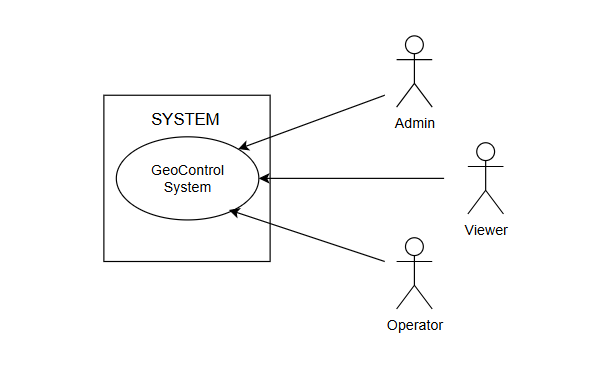

# Requirements Document - GeoControl

Date:

Version: V1 - description of Geocontrol as described in the swagger

| Version number | Change |
| :------------: | :----: |
|                |        |

# Contents

- [Requirements Document - GeoControl](#requirements-document---geocontrol)
- [Contents](#contents)
- [Informal description](#informal-description)
- [Business model](#business-model)
- [Stakeholders](#stakeholders)
- [Context Diagram and interfaces](#context-diagram-and-interfaces)
  - [Context Diagram](#context-diagram)
  - [Interfaces](#interfaces)
- [Stories and personas](#stories-and-personas)
- [Functional and non functional requirements](#functional-and-non-functional-requirements)
  - [Functional Requirements](#functional-requirements)
  - [Non Functional Requirements](#non-functional-requirements)
- [Use case diagram and use cases](#use-case-diagram-and-use-cases)
  - [Use case diagram](#use-case-diagram)
    - [Use case 1, UC1](#use-case-1-uc1)
      - [Scenario 1.1](#scenario-11)
      - [Scenario 1.2](#scenario-12)
      - [Scenario 1.x](#scenario-1x)
    - [Use case 2, UC2](#use-case-2-uc2)
    - [Use case x, UCx](#use-case-x-ucx)
- [Glossary](#glossary)
- [System Design](#system-design)
- [Deployment Diagram](#deployment-diagram)

# Informal description

GeoControl è un software progettato per monitorare le variabili fisiche e ambientali in vari contesti: da analisi idrologiche di aree montane al sorvegliamento di edifici storici, e anche il controllo di parametri interni (quali temperatura o illuminazione) in aree residenziali o di lavoro.

# Business Model

- __Private-as-a-Service__:
  una compagnia privata sviluppa e gestisce il sistema offrendo il servizio ad amministrazioni pubbliche su base contrattuale.

- __Software con licenza__:
  la compagnia che sviluppa GeoControl vende il software offrendo licenza annuale o come one time purchase. Nella licenza annuale potrebbe essere incluso un pacchetto di supporto tecnico e manutenzione della parte hardware del systema (sensori e gateway).

- __Modello Open Core__:
  si offre una versione open source del software e vengono venduti moduli premium con funzionalità più avanzate e servizi di personalizzazione e integrazione. È utile per creare parallelamente una community di sviluppatori che contribuisce al miglioramento del prodotto.

- __partnership__:
  collaborare con produttori di sensori integrando al meglio il loro hardware con GeoControl e con società di consulenza ambientale/ingegneristica. Stabilire anche accordi di guadagno con partner che portano nuovi clienti.

# Stakeholders

| Stakeholder name | Description |
| :--------------- | :---------- |
|       Admin      |  Utente che ha accesso a tutte le risorse, inclusa la gestione di Networks e Utenti |
|      Operator    |  Utente che può gestire Network, Gateway, Sensori e inserire misurazioni |
|       Viewer     |  Utente che può solo consultare i dati |
| Unione delle Comunità Montane del Piemonte | Committente principale del Sistema |
| Enti Pubblici e Privati | Università, cittadine, Protezione Civile o aziende che vogliono usufruire dei servizi del Sistema |
| Produttori di Componenti | Coloro che si occupano di produzione e distribuzione dell'Hardware utilizzato nel Sistema |

# Context Diagram and interfaces

## Context Diagram

\<Define here Context diagram using UML use case diagram>
<p align="center">
    
</p>

\<actors are a subset of stakeholders>

## Interfaces

\<describe here each interface in the context diagram>


|   Actor   | Logical Interface | Physical Interface |
| :-------- | :---------------: | :----------------: |
| Admin     | GUI               | PC                 |
| Operator  | GUI               | PC                 |
| Viewer    | GUI               | PC, Smartphone     |

# Stories and personas

\<A Persona is a realistic impersonation of an actor. Define here a few personas and describe in plain text how a persona interacts with the system>

\<Persona is-an-instance-of actor>

\<stories will be formalized later as scenarios in use cases>

- Persona1 : Uomo, Adulto, 50 anni, Lavora come informatico nel comune di una cittadina ad alto rischio sismico
  Storia : Ha bisogno di un Sistema per monitorare l'attività sismica della città

- Persona2 : Donna, Giovane, 25 anni, lavora in una riserva naturale come guida
  Storia : Ha bisogno di sapere in anticipo le condizioni climatiche per evitare di mettere in pericolo i visitatori durante le passeggiate

- Persona3 : Uomo, Età media, 34 anni, gestore hotel in alta quota aperto in periodo invernale
  Storia : Ha bisogno di un sistema per monitorare il rischio di valanghe o temperature estreme al fine di migliorare l'esperienza di chi alloggia nell'hotel

- Persona4: Gruppo di ricerca universitario
  Storia: Hanno bisogno di dati ambientali per testare modelli di machine learning per predizioni metereologiche per una ricerca

- Persona5: Donna, Adulta, 46 anni, preside di una scuola media
  Storia: Nell'attesa di un cambio struttura, la preside ha bisogno di monitorare alcuni parametri particolari di quella attuale, vecchia e decadente, ad esempio crepe e fessurazioni o vibrazioni anomale.

# Functional and non functional requirements

## Functional Requirements

\<In the form DO SOMETHING, or VERB NOUN, describe high level capabilities of the system>

\<they match to high level use cases>

|  ID   | Description |
| :---: | :---------: |
|  FR1  | Gestione autenticazione utente |
|  FR1.1 | Login utente |
|  FR1.2 | Logout utente |
|  FR2   | Gestione utenti|
|  FR2.1 | Creazione account|
|  FR2.2 | Recupero utenti |
|  FR2.3 | Recupero utente specifico |
|  FR2.4 | Eliminazione account |
|  FR3  | Gestione networks |
|  FR3.1  | Creazione network |
|  FR3.2  | Recupero networks |
|  FR3.2  | Recupero network specifica |
|  FR3.3  | Modifica dati network |
|  FR3.4  | Eliminazione network |
|  FR4  | Gestione gateways |
|  FR4.1 | Creazione gateway |
|  FR4.2 | Recupero tutti gateway |
|  FR4.3 | Recupero gateway specifico | 
|  FR4.4 | Modifica dati gateway |
|  FR4.5 | Eliminazione gateway |
|  FR5  | Gestione sensori |
|  FR5.1 | Creazione sensore |
|  FR5.2 | Recupero tutti sensori per gateway specifico |
|  FR5.3 | Recupero sensore specifico|
|  FR5.4 | Modifica dati sensore |
|  FR5.5 | Eliminazione sensore|
|  FR6   | Calcolo statistiche misurazioni |
|  FR6.1  | Calcolo media di misurazioni su range temporale |
|  FR6.2  | Calcolo varianza di misurazioni su range temporale |
|  FR6.3  | Calcolo threshold tramite media e varianza |
|  FR7  | Collezionamento e memorizzazione misurazioni |
|  FR7.1  | Lettura misurazioni network |
|  FR7.2  | Lettura misurazioni gateway |
|  FR7.3  | Lettura misurazioni sensore |
|  FR7.4  | Lettura outliers sensore |
|  FR7.5  | Lettura outliers network |
|  FR7.6  | Lettura statistiche sensore |
|  FR7.7  | Memorizzazione di misurazioni sensore |

## Non Functional Requirements

\<Describe constraints on functional requirements>

|   ID    | Type (efficiency, reliability, ..) | Description | Refers to |
| :-----: | :--------------------------------: | :---------: | :-------: |
|  NFR1   |  Domain                            | Il sistema deve convertire, memorizzare e restituire i timestamp nel formato ISO 8601 (UTC) | FR 6 |
|  NFR2   |  Reliability                       | Non devono essere perse più di 6 misurazioni per sensore ogni anno | FR 6 |
|  NFR3   |  Reliability                       | Il timestamp deve corrispondere all'esatto momento della misurazione | FR 6 |
|  NFR4   |  Reliability                       | Il flusso di misurazioni non deve essere interrotto | FR 6 |
|  NFR5   |  Domain                            | La misurazioni deve avvenire ogni 10 minuti | FR 6 |


# Use case diagram and use cases

## Use case diagram

\<define here UML Use case diagram UCD summarizing all use cases, and their relationships>

\<next describe here each use case in the UCD>

### Use case 1, UC1

| Actors Involved  |                                                                      |
| :--------------: | :------------------------------------------------------------------- |
|   Precondition   | \<Boolean expression, must evaluate to true before the UC can start> |
|  Post condition  |  \<Boolean expression, must evaluate to true after UC is finished>   |
| Nominal Scenario |         \<Textual description of actions executed by the UC>         |
|     Variants     |                      \<other normal executions>                      |
|    Exceptions    |                        \<exceptions, errors >                        |

##### Scenario 1.1

\<describe here scenarios instances of UC1>

\<a scenario is a sequence of steps that corresponds to a particular execution of one use case>

\<a scenario is a more formal description of a story>

\<only relevant scenarios should be described>

|  Scenario 1.1  |                                                                            |
| :------------- | :------------------------------------------------------------------------- |
|  Precondition  | \<Boolean expression, must evaluate to true before the scenario can start> |
| Post condition |  \<Boolean expression, must evaluate to true after scenario is finished>   |
|     Step#      |                                Description                                 |
|       1        |                                                                            |
|       2        |                                                                            |
|      ...       |                                                                            |

##### Scenario 1.2

##### Scenario 1.x

### Use case 2, UC2

..

### Use case x, UCx

..

# Glossary

\<use UML class diagram to define important terms, or concepts in the domain of the application, and their relationships>

\<concepts must be used consistently all over the document, ex in use cases, requirements etc>

- `Network`: gruppo logico di gateway (e sensori associati), identificati da un codice alfanumerico univoco (scelto in creazione). Può rappresentare, ad esempio, una rete di monitorazione per un'intero palazzo. Non corrisponde a un device fisico ma è un oggetto software per organizzare e gestire gruppi diversi di device.

- `Gateway`: un device fisico identificato dal suo indirizzo MAC, fornito di intefaccia di rete e connesso tramite essa al sistema GeoControl.

- `Sensore`: device fisico che misura la quantità fisica (temperatura, inclinazione, etc) ogni 10 minuti. Non è fornito di interfaccia di rete ma è identificato unicamente dal suo indirizzo MAC. Comunica esclusivamente con il suo gateway corrispondente tramite connessione seriale, mandando la misurazione.

- `Misurazione`: è costituita dal valore misurato e dal timestamp della misurazione.

- `Statistiche di misurazioni`: _media_ ($\sigma$) e _varianza_ ($\mu$) di un insieme di misurazioni eseguite in un certo range temporale. Tramite questi due valori vengono poi calcolate:
	- _upper threashold_ = $\mu+2\sigma$
	- _lower threshold_ = $\mu-2\sigma$.


- `Misurazione Outlier`: ogni misurazione con valore più alto della `upperThreshold` o più basso della `lowerThreshold` considerando un insieme di misurazioni su un range temporale.

``` plantuml

class Network {
  - codice
  - nome
  - descrizione
}

class Gateway {
 - MAC
 - nome
 - descrizione
}

class Sensore {
 - MAC
 - nome
 - descrizione
 - variabile
 - unità di misura
}

class Misurazioni {
  - data inizio
  - data fine
  - media
  - varianza
  - upperThreshold
  - lowerThreshold
}

class Misurazione {
 - timestamp
 - valore
 - isOutlier
}

Network o-- "*" Gateway
Gateway o-- "*" Sensore
Sensore "1" -- "*" Misurazioni : associateA <
Misurazione "*" -- "1" Misurazioni : in >

```

# System Design

\<describe here system design>

\<must be consistent with Context diagram>

# Deployment Diagram

\<describe here deployment diagram >

