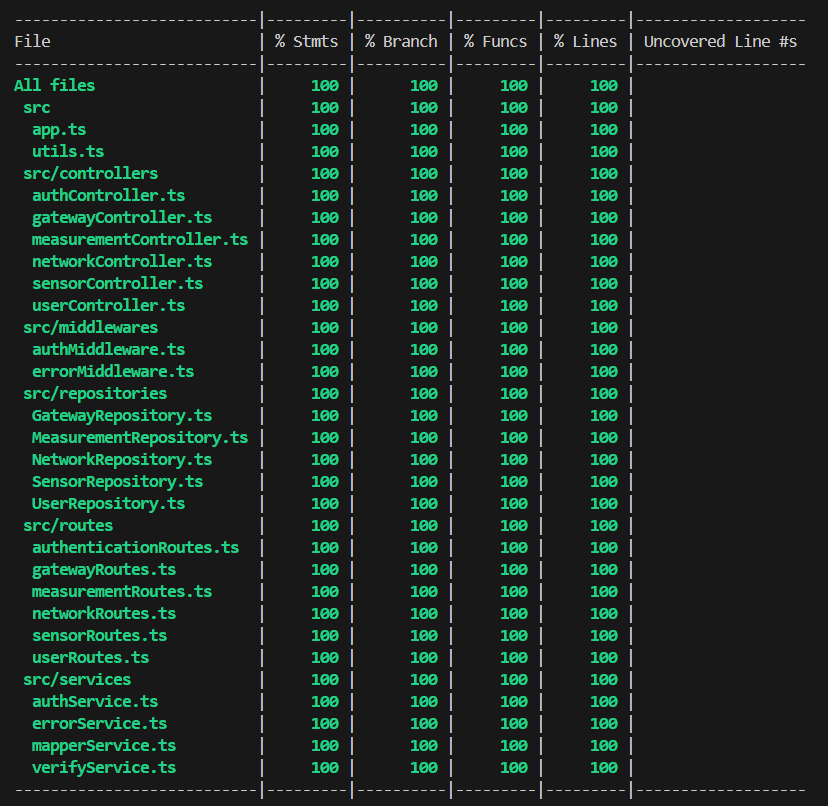

# Test Report

<The goal of this document is to explain how the application was tested, detailing how the test cases were defined and what they cover>

# Contents

- [Test Report](#test-report)
- [Contents](#contents)
- [Dependency graph](#dependency-graph)
- [Integration approach](#integration-approach)
- [Tests](#tests)
- [Coverage](#coverage)
  - [Coverage of FR](#coverage-of-fr)
  - [Coverage white box](#coverage-white-box)

# Dependency graph

  Nota: nel caso l'immagine non dovesse essere visibile si apra direttamente il file `dependency-graph.svg` nella cartella root del progetto.

# Integration approach

    <Write here the integration sequence you adopted, in general terms (top down, bottom up, mixed) and as sequence

    (ex: step1: unit A, step 2: unit A+B, step 3: unit A+B+C, etc)>

    <Some steps may  correspond to unit testing (ex step1 in ex above)>

    <One step will  correspond to API testing, or testing unit route.js>
  
  L'approccio di integrazione è stato principalmente bottom-up:

  NETWORK
  step1: unit NetworkRepository
  ***DA COMPLETARE***

  GATEWAY
  step1: unit GatewayRepository
  step2: unit GatewayRepository+gatewayController
  step3: unit GatewayRepository+gatewayController+mapperService
  step4: unit GatewayRepository+gatewayController+mapperService+verifyService
  step5: unit gatewayRoutes+authMiddlewere+validatorMiddlewere
  step6: e2e

# Tests

<in the table below list the test cases defined For each test report the object tested, the test level (API, integration, unit) and the technique used to define the test case (BB/ eq partitioning, BB/ boundary, WB/ statement coverage, etc)> <split the table if needed>

| Test case name | Object(s) tested | Test level | Technique used |
| :------------: | :--------------: | :--------: | :------------: |
| gateways-controller-should return all gateways for a network                     | `GET /networks/:code/gateways`      | E2E        | BB |
| gateways-controller-should return empty array if network has no gateways         | `GET /networks/:code/gateways`      | E2E        | BB |
| gateways-controller-should return 401 for unauthorized access to gateway list    | `GET /networks/:code/gateways`      | E2E        | BB |
| gateways-controller-should return 404 for non-existent network on gateway list   | `GET /networks/:code/gateways`      | E2E        | BB |
| gateways-controller-should return a specific gateway                             | `GET /networks/:code/gateways/:mac` | E2E        | BB |
| gateways-controller-should return 404 for invalid chain of entities              | `GET /networks/:code/gateways/:mac` | E2E        | BB |
| gateways-controller-should return 404 for non-existent gateway                   | `GET /networks/:code/gateways/:mac` | E2E        | BB |
| gateways-controller-should return 401 for unauthorized access to single gateway  | `GET /networks/:code/gateways/:mac` | E2E        | BB |
| gateways-controller-should return 404 for non-existent network in single gateway | `GET /networks/:code/gateways/:mac` | E2E        | BB |
| gateways-controller-should return 409 for MAC already used by a sensor           | `POST /networks/:code/gateways`     | E2E        | BB |
| gateways-controller-should create a new gateway                                  | `POST /networks/:code/gateways`     | E2E        | BB |
| gateways-controller-should create gateway without optional fields                | `POST /networks/:code/gateways`     | E2E        | BB |
| gateways-controller-should ignore extra fields during gateway creation           | `POST /networks/:code/gateways`     | E2E        | BB |
| gateways-controller-should return 400 for invalid gateway data (POST)   | `POST /networks/:code/gateways`                | E2E        | BB             |
| gateways-controller-should return 400 for missing required fields        | `POST /networks/:code/gateways`                | E2E        | BB             |
| gateways-controller-should return 401 for unauthorized access (POST)     | `POST /networks/:code/gateways`                | E2E        | BB             |
| gateways-controller-should return 403 for being just a viewer (POST)     | `POST /networks/:code/gateways`                | E2E        | BB             |
| gateways-controller-should return 404 for non-existent network (POST)    | `POST /networks/:code/gateways`                | E2E        | BB             |
| gateways-controller-should return 409 for MAC already in use             | `POST /networks/:code/gateways`                | E2E        | BB             |
| gateways-controller-should update gateway without changing macAddress    | `PATCH /networks/:code/gateways/:mac`          | E2E        | BB             |
| gateways-controller-should return 409 if MAC used by another gateway     | `PATCH /networks/:code/gateways/:mac`          | E2E        | BB             |
| gateways-controller-should return 409 if MAC used by a sensor            | `PATCH /networks/:code/gateways/:mac`          | E2E        | BB             |
| gateways-controller-should do nothing with empty body                    | `PATCH /networks/:code/gateways/:mac`          | E2E        | BB             |
| gateways-controller-should update gateway and change macAddress          | `PATCH /networks/:code/gateways/:mac`          | E2E        | BB             |
| gateways-controller-should return 400 for invalid data (PATCH)           | `PATCH /networks/:code/gateways/:mac`          | E2E        | BB             |
| gateways-controller-should return 401 for unauthorized access (PATCH)    | `PATCH /networks/:code/gateways/:mac`          | E2E        | BB             |
| gateways-controller-should return 403 for being just a viewer (PATCH)    | `PATCH /networks/:code/gateways/:mac`          | E2E        | BB             |
| gateways-controller-should return 404 for non-existent gateway (PATCH)   | `PATCH /networks/:code/gateways/:mac`          | E2E        | BB             |
| gateways-controller-should return 404 for non-existent network (PATCH)   | `PATCH /networks/:code/gateways/:mac`          | E2E        | BB             |
| gateways-controller-should delete a gateway                              | `DELETE /networks/:code/gateways/:mac`         | E2E        | BB             |
| gateways-controller-should return 404 for non-existent gateway (DELETE)  | `DELETE /networks/:code/gateways/:mac`         | E2E        | BB             |
| gateways-controller-should return 401 for unauthorized access (DELETE)   | `DELETE /networks/:code/gateways/:mac`         | E2E        | BB             |
| gateways-controller-should return 403 for being just a viewer (DELETE)   | `DELETE /networks/:code/gateways/:mac`         | E2E        | BB             |
| gateways-controller-should return 404 for non-existent network (DELETE)  | `DELETE /networks/:code/gateways/:mac`         | E2E        | BB             |

# Coverage

## Coverage of FR

<Report in the following table the coverage of functional requirements and scenarios(from official requirements) >

| Functional Requirement or scenario                                     |Test(s)|
| :--------------------------------------------------------------------: |:-----:|
| **FR1**   Authentication                                               |**14** |
| FR1.1 Authenticate user                                                |  14   |
| **FR2**   Manage users                                                 |**41** |
| FR2.1 Retrieve all users                                               |  9    |
| FR2.2 Create a new user                                                |  14   |
| FR2.3 Retrieve a specific user                                         |  10   |
| FR2.4 Delete a specific user                                           |  8    |
| **FR3**   Manage networks                                              |**51** |
| FR3.1 Retrieve all networks                                            |  7    |
| FR3.2 Create a new network                                             |  13   |
| FR3.3 Retrieve a specific network                                      |  9    | 
| FR3.4 Update a network                                                 |  14   |
| FR3.5 Delete a specific network                                        |  8    | 
| **FR4**   Manage gateways                                              |**62** |
| FR4.1 Retrieve all gateways of a network                               |  9    |  
| FR4.2 Create a new gateway for a network                               |  17   |   
| FR4.3 Retrieve a specific gateway                                      |  11   |
| FR4.4 Update a gateway                                                 |  16   |
| FR4.5 Delete a specific gateway                                        |  9    |
| **FR5**   Manage sensors                                               |**55** |
| FR5.1 Retrieve all sensors of a gateway                                |  10   | 
| FR5.2 Create a new sensor for a gateway                                |  15   |
| FR5.3 Retrieve a specific sensor                                       |  8    | 
| FR5.4 Update a sensor                                                  |  13   |
| FR5.5 Delete a specific sensor                                         |  9    |
| **FR6**   Manage measurements                                          |**68** |
| FR6.1 Retrieve measurements for a set of sensors of a specific network |  18   |
| FR6.2 Retrieve statistics for a set of sensors of a specific network   |  8    |
| FR6.3 Retrieve outliers for a set of sensors of a specific network     |  8    |
| FR6.4 Store measurements for a specific sensor                         |  9    |
| FR6.5 Retrieve measurements for a specific sensor                      |  12   |
| FR6.6 Retrieve statistics for a specific sensor                        |  6    |
| FR6.7 Retrieve outliers for a specific sensor                          |  7    |

## Coverage white box

Report here the screenshot of coverage values obtained with jest-- coverage

